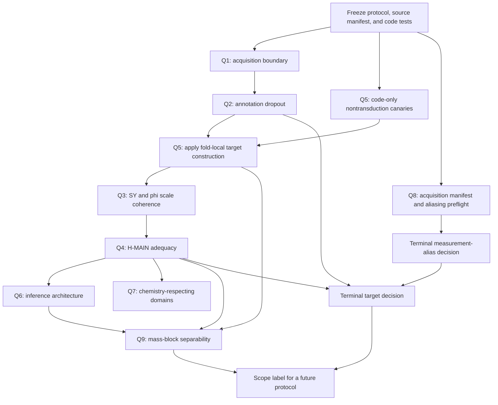

# MURU Real Data Object Qualification Study

## Proposed prospective preregistration

**Status:** Draft only. This document is not a new numbered phase, does not authorize Phase 4, and must be frozen, hashed, and reviewed before raw-file retrieval or any qualification result is generated.

## 1. Study title and terminal vocabulary

This study is named **MURU Real Data Object Qualification Study**.

It has exactly three terminal study-level outcomes:

1. **REAL DATA OBJECT QUALIFIED FOR FUTURE PHASE 4 DESIGN**
2. **DO NOT SEARCH THIS TARGET**
3. **INCONCLUSIVE DUE TO MEASUREMENT LIMITATION**

A protocol breach is not a fourth outcome. It voids the run and requires a new prospective protocol.

## 2. Historical boundary

The study begins from these binding facts:

- Phase 3 completed at commit `211b500` with `STOP BEFORE PHASE 4`.
- Type 2 was frozen before fresh worlds at `307e4e0`.
- Type 2 completed at `adf7b3b` with `DO NOT AUTHORIZE PHASE 4`.
- Type 2 stopped solely because frozen independent-engine corroboration failed.
- The later frozen engine-competence audit on `audit/engine-competence`, final commit `fac0118`, diagnosed D1 + D5. It does not change either earlier verdict.
- The target-permutation construction that permutes energy within compound is not automatically valid for scalar `g`; it preserves level information related to the fitted scale and can make a null threshold too conservative.
- The highest defensible real-data claims rung remains L3.
- No real-data symbolic search has run.
- The confirmation set remains governed as a sealed 110-compound identifier-only exclusion set.

This qualification study does not reinterpret, amend, rerun, or overwrite Phase 3 or Type 2.

## 3. Scientific question

For positive-mode ENTACT development compounds on the existing Q Exactive HCD NCE grid, can the observed endpoint `mu` and a molecule-specific horizontal energy scale `g` be defined and evaluated without unresolved acquisition-floor artifacts, annotation dropout, endpoint incoherence, transductive target construction, collapse misspecification, or CE/run-order aliasing severe enough to make a later symbolic search scientifically meaningless?

## 4. Scientific object

For compound `i` and NCE setting `E`:

\[
\mu_i(E) \approx \Phi(E/g_i), \qquad g_i>0.
\]

`mu` is computed directly as the intensity-weighted normalized first mass moment. It is not reconstructed from the approximate `SY + (1-SY)phi` identity. The exact decomposition retains the observed-to-declared precursor-mass ratio.

`Phi` is a shared monotone decreasing response shape learned from training compounds only. `g_i` is a positive horizontal scale estimated against that frozen training-only `Phi`.

The scalar has arbitrary multiplicative scale. Each outer training fit sets the training geometric mean of `g` to one. All comparisons use `log(g)` after that fold-local normalization.

## 5. Domain

Primary domain:

- ENTACT development compounds only.
- Positive ion mode.
- Existing NCE settings `{15, 30, 45, 60, 75, 90}`.
- One Q Exactive HCD campaign.
- Curated MassBank spectra as the full-corpus branch, with raw mzML as the specified measurement branch.
- Current scaffold-disjoint development population.

NCE remains the analysis axis. This study makes no absolute-energy, eV, center-of-mass, cross-instrument, or mechanism claim.

## 6. Explicit exclusions

This study does not test or perform:

- descriptor equations;
- symbolic regression;
- symbolic-engine selection;
- physical laws or fragmentation mechanisms;
- negative-mode generality;
- cross-instrument generality;
- confirmation-set evaluation;
- Phase 4;
- a fallback to H-PARAM if scalar H-MAIN fails.

## 7. Source data and source locking

Before retrieval or analysis, create a source manifest containing:

- MassBank release commit and hashes;
- permitted raw campaign name: `20200303_ENTACT_RP_mzML`;
- raw file path, SHA-256, mode, mix, NCE, acquisition-time provenance, method identifier, and retrieval timestamp;
- software environment, parser version, configuration hash, random seeds, and code commit;
- development/confirmation membership hash.

Only positive-mode raw files from the documented campaign may enter Q1, Q2, or Q8. Files from the earlier campaign are excluded.

File availability is recorded as availability information only. It is not a scientific result and cannot change thresholds, matching rules, or the analysis population.

## 8. Confirmation sealing

The confirmation set remains unopened.

Qualification code may read sealed connectivity identifiers only to exclude them. It may not load, derive, cache, log, serialize, or score a confirmation response, trajectory, target, descriptor row, raw-scan match, or prediction.

Every qualification artifact must be scanned for sealed identifiers before publication. The expected seal schema remains identifier-only. The historic seal hash is retained as a preflight assertion; this draft does not recompute it.

## 9. Dependency graph

The proposed parallel first block is only partly valid:

- Q1 and Q8 can share a read-only raw-file parse after protocol freeze.
- Q5 can run code-only leakage canaries in parallel.
- Q2 cannot begin until Q1 has frozen the common acquisition boundary.
- Actual Q5 target construction cannot begin until Q1 and Q2 establish the endpoint branch and boundary.

## 10. Q1: Actual low-mass acquisition boundary

### Purpose

Determine the actual scan-level lower-mass boundary and distinguish:

1. the instrument-method floor;
2. the first detected raw centroid;
3. the curated or formula-annotation floor.

The historical 30, 50, and 80 Da sensitivity worlds are contextual only. They are not substitutes for this measurement.

### Frozen data fields

For every raw MS2 scan:

- raw-file identifier and SHA-256;
- scan identifier;
- MS level;
- acquisition timestamp or source-order token;
- scan-window lower bound and provenance;
- selected precursor m/z;
- centroid m/z and intensity arrays;
- mode, mix, NCE, method identifier, and parser warnings.

For every matched curated record:

- accession;
- declared precursor m/z;
- base-cell peak list;
- formula-annotation status;
- `mu`, `SY`, and `phi`;
- NCE and source provenance.

### Definitions

- `L_method,f`: documented lower scan-window boundary for raw file `f`.
- `L_raw,s`: minimum positive-intensity centroid in raw scan `s`.
- `L_curated,r`: minimum curated peak m/z in record `r`.
- `L_common`: the maximum documented `L_method,f` among all raw files used in the qualification analysis.

No inferred floor from first observed peaks may replace a missing method boundary.

### Computation

For every matched compound-energy cell, recompute raw and curated endpoints after excluding peaks below `L_common`, using the base preprocessing cell:

- relative cutoff `0`;
- precursor retained;
- raw intensity weighting;
- 10 ppm precursor matching.

For each compound:

\[
D_i=\sqrt{\frac{1}{n_i}\sum_E
  [\mu_i^{\text{original}}(E)-\mu_i^{\text{common-bound}}(E)]^2}.
\]

The primary Q1 sensitivity statistic is the scaffold-bootstrap 95th percentile of `D_i`.

### Required plots

- file-by-file documented scan-window lower bounds;
- distribution of first raw centroids by file and NCE;
- distribution of curated floors by NCE;
- raw versus curated floor distributions on matched cells;
- `D_i` distribution and Q1 common-bound endpoint shifts by NCE.

### Missing-data behavior

- A raw file without a documented method boundary cannot support an actual-boundary claim.
- A scan without usable centroid data is missing, not zero.
- A file-level boundary conflict is recorded. `L_common` is still the maximum documented floor if all files have valid provenance.
- No endpoint, peak, or floor is imputed.

### Q1 decision rule

**Pass** requires all of the following:

- every raw file used has a documented method boundary;
- `L_common` is computable;
- the upper 95% scaffold-bootstrap bound for the 95th percentile of `D_i` is at most `0.0295`.

**Fail** occurs if the lower 95% bound for that statistic exceeds `0.0295`. This means the common-bound correction exceeds the historical conservative repeatability reference for the protected tail of compounds.

**Inconclusive** occurs if boundary metadata are incomplete, raw coverage is inadequate, or the interval crosses `0.0295`.

The `0.0295` value is an inter-mixture repeatability upper bound, not an instrument-noise floor. Q1 passing does not establish instrument-level repeatability.

## 11. Q2: Energy- and fragment-mass-dependent annotation dropout

### Purpose

Determine whether curation or formula annotation preferentially removes low-relative-mass fragments at high NCE and whether that process can explain a material portion of the observed energy-dependent mass association.

### Eligibility

The primary `mu` comparison requires at least 100 development compounds from at least 20 S2 scaffold groups with paired raw/curated observations at NCE 15 and 90.

The `phi` diagnostic additionally requires finite `phi` on at least three of `{45, 60, 75, 90}`. Failure to meet either coverage requirement is measurement-limited inconclusive.

### Frozen raw-to-curated peak matching

1. Match raw scans to the development target using precursor m/z within 10 ppm and retention time within ±0.5 minutes.
2. Merge raw matched scans with greedy 10 ppm centroid merging.
3. Apply `L_common` before peak matching.
4. Match a raw centroid to a curated peak only when it is the reciprocal nearest neighbor within 10 ppm.
5. A raw centroid with multiple eligible curated matches, or a non-reciprocal nearest match, is `AMBIGUOUS`.
6. `AMBIGUOUS` is not counted as retained or dropped. Its rate is reported by NCE and relative fragment mass.
7. A unique raw centroid with no curated match is `UNMATCHED`.
8. Curated-only peaks are reported separately and are not reverse-labelled as raw dropout.

### Peak-retention model

For unique raw peaks, let:

- `R=1` if retained in curated data;
- `r=mz_raw/precursor_mz`;
- `x=(NCE-15)/75`;
- `q` be raw relative intensity.

Fit the frozen model:

\[
\operatorname{logit}\Pr(R=1)=
\beta_0+\beta_1\log r+\beta_2x+\beta_3x\log r+
\beta_4\log(q)+\alpha_{\text{compound}}+\alpha_{\text{file}}.
\]

The compound and file terms are fixed effects. Inference uses scaffold-clustered bootstrap refits, not model-based p-values.

The primary dropout contrast is the predicted difference in retention between `r=0.20` and `r=0.80` as NCE moves from 15 to 90. It is descriptive unless it links to the endpoint association below.

### Endpoint association analysis

Compute raw and curated `mu` and `phi` on the matched cells after Q1 common-bound recomputation.

For each endpoint, fit the paired branch-difference model:

\[
\delta_{iE}=Y^{\text{curated}}_{iE}-Y^{\text{raw}}_{iE}
=\eta_0+\eta_1x+\eta_2z_i+\eta_3xz_i+\alpha_i+\epsilon_{iE},
\]

where `z_i` is standardized `log(precursor_mz)`.

Let `kappa_curated` be the curated energy-by-mass coefficient from the corresponding curated-only model. Define:

\[
F_Y=\eta_3/\kappa_{\text{curated}}
\]

only when the numerator and denominator have the same sign and the curated denominator is estimable. `F_Y` is the fraction of the curated energy-dependent mass association attributable to branch difference.

`F_mu` is primary. `F_phi` is a diagnostic required for a coherent interpretation of the blended endpoint.

### Q2 decision rule

**Pass** requires:

- the upper 95% scaffold-bootstrap bound of `F_mu` is below `0.20`;
- no `phi` result shows a contrary material curation pattern that makes the blended-endpoint interpretation unresolved;
- all matching and ambiguity rates are reported.

**Fail** occurs if the lower 95% scaffold-bootstrap bound for `F_mu` is at least `0.20` in the curation-amplifying direction.

**Inconclusive** occurs if coverage is inadequate, `kappa_curated` is not estimable, the primary interval crosses the materiality threshold, or `mu` and `phi` give incompatible curation diagnoses.

Overall raw-versus-curated correlation is reported but cannot produce a pass.

## 12. Q3: Scientific coherence of the blended endpoint

### Purpose

Test whether the precursor-survival-dominated low-energy regime and the fragment-depth-dominated high-energy regime imply compatible molecule-specific horizontal scales.

### Frozen regimes and eligibility

- Low-energy `SY` regime: NCE `{15, 30}`.
- High-energy `phi` regime: NCE `{45, 60, 75, 90}`.
- `SY` eligibility: both low-energy values are finite and in `(0.02, 0.98)`.
- `phi` eligibility: finite at at least three high-energy settings.
- Paired Q3 eligibility requires both conditions.

No `SY`, `phi`, or endpoint substitution is allowed after results are seen.

### Estimation

For each outer S2 fold:

1. Fit a monotone training-only `Phi_SY` from eligible training `SY` trajectories.
2. Fit a monotone training-only `Phi_phi` from eligible training `phi` trajectories.
3. Estimate `log(g_SY)` and `log(g_phi)` for held-out compounds by profile SSE against the corresponding frozen curve.
4. Estimate fold-local uncertainty from training-derived residual variance and profile curvature.
5. Align scales using only the training overlap:

\[
a_f=\operatorname{median}_{\text{training}}
[\log(g_{SY})-\log(g_{\phi})].
\]

6. Compare `log(g_SY)` with `log(g_phi)+a_f` in held-out compounds.

No slope, rank, or nonlinear alignment may be fit on held-out compounds.

### Statistics

- **Rank agreement:** pooled out-of-fold Spearman correlation.
- **Excess disagreement:**

\[
ED=\sqrt{\max\{0,\,
\operatorname{mean}(d_i^2)-
\operatorname{mean}(v_{SY,i}+v_{\phi,i})\}},
\]

where \(d_i=\log(g_{SY,i})-\log(g_{\phi,i})-a_f\).

- **Reversal rate:** fraction of reliably ordered compound pairs whose `SY` and `phi` scale orderings disagree. A pair is reliable only when both scale differences exceed their propagated uncertainty.

Use 2,000 scaffold-bootstrap resamples.

### Minimum information

The pooled out-of-fold eligible set must contain at least 100 compounds from at least 20 S2 scaffold groups. Each outer fold must contribute at least 20 eligible compounds and five scaffold groups.

### Q3 classifications

| Classification | Required condition |
|---|---|
| `COHERENT` | lower 95% bound for rank agreement ≥ 0.70; upper bound for `ED` ≤ 0.25 log-scale units; upper bound for reversal rate ≤ 0.20; minimum information met |
| `PARTIALLY COHERENT` | not coherent or incoherent, but lower rank bound ≥ 0.40 and no incoherence criterion fires |
| `INCOHERENT` | upper rank bound < 0.40, or lower `ED` bound > 0.40, or lower reversal-rate bound > 0.35 |
| `INCONCLUSIVE` | eligibility, coverage, numerical identifiability, or interval resolution is insufficient |

Any Q3 result other than `COHERENT` produces **DO NOT SEARCH THIS TARGET**. There is no switch to an `SY`-only or `phi`-only symbolic target.

## 13. Q4: Real-data H-MAIN adequacy

### Purpose

Determine whether one shared monotone `Phi` plus one molecule-specific horizontal scale adequately describes observed `mu`.

### Primary model

\[
M_0:\quad \mu_{iE}=\Phi(E/g_i)+\epsilon_{iE}.
\]

`Phi` is monotone, shared, and learned from outer-training compounds only.

### Prespecified alternatives

The alternatives diagnose specific violations. None permits an unrestricted multi-parameter curve per compound.

| Model | Detects |
|---|---|
| `M_H` | horizontal-shape heterogeneity through a shrunk random shape exponent \(p_i\) |
| `M_L` | low-energy vertical heterogeneity through a shrunk compound effect multiplied by \(L(E)=(1,.5,0,0,0,0)\) |
| `M_U` | high-energy vertical heterogeneity through a shrunk compound effect multiplied by \(U(E)=(0,0,0,\frac13,\frac23,1)\) |
| `M_R` | gross shared regime switching through two shared monotone curves blended by \(W(E)=(0,0,.5,1,1,1)\), with the same compound `g_i` |

Variance components and shared curves are fit from training compounds only. The alternatives are diagnostic comparators, never future fallbacks.

### Evaluation

Use outer five-fold S2 evaluation and repeat under S3 as a stress analysis.

For each held-out compound and each NCE:

1. withhold that NCE;
2. estimate only the compound-specific latent quantities from the remaining held-out energies against the frozen training fit;
3. predict the withheld `mu`;
4. aggregate absolute error within compound.

Use 2,000 scaffold bootstrap resamples for S2 and 2,000 cluster resamples for S3.

### Model-comparison decision

For each alternative:

\[
I_a=100\frac{\mathrm{MAE}(M_0)-\mathrm{MAE}(M_a)}
{\mathrm{MAE}(M_0)}.
\]

The primary multiplicity-adjusted statistic is the bootstrap maximum over all four alternatives. H-MAIN is rejected if the lower simultaneous 95% bound for the maximum improvement exceeds 5%.

The 5% threshold is inherited from the Phase 2 K4B materiality rule, pending the calibration condition in Section 21.

### Absolute repeatability comparison

The S2 held-out `M_0` RMSE is compared with `0.0295`.

- If its upper 95% scaffold-bootstrap bound is at most `0.0295`, the absolute comparison is compatible with the historic conservative repeatability reference.
- If its lower bound exceeds `0.0295`, the absolute comparison fails.
- Otherwise it is measurement-limited inconclusive.

This is not a claim that residual error is below instrument noise. The historic value is an upper-bound inter-mixture estimate.

### Q4 decision rule

**Pass:** no material alternative improvement and the absolute comparison passes.

**Fail:** H-MAIN rejection or absolute-comparison failure. This yields **DO NOT SEARCH THIS TARGET**.

**Inconclusive:** insufficient coverage, model fit failure, unresolved interval, or unsupported S2/S3 contradiction. This yields **INCONCLUSIVE DUE TO MEASUREMENT LIMITATION**.

No H-PARAM rescue is allowed.

## 14. Q5: Nontransductive target construction

### Chronology

For each outer S2 or S3 split:

1. split compounds before seeing any fold-specific target;
2. exclude confirmation identifiers;
3. fit `Phi` on training compounds only;
4. estimate training `g`;
5. set training geometric mean `g` to one;
6. estimate training residual variance by grouped cross-fitting inside the outer training set;
7. freeze training variance, curvature policy, and weights;
8. estimate held-out `g_i` only against frozen training `Phi`;
9. derive held-out uncertainty only from frozen training variance and held-out profile curvature.

Held-out trajectories may affect their own `g_i` only. They cannot affect `Phi`, scale normalization, residual variance, weighting, knot locations, preprocessing, or any other training-derived quantity.

### Primary estimator

The implementation must provide a fold-local version of the existing monotone-collapse estimator:

- three alternations;
- 60 fixed log-scale interpolation knots;
- training-only normalization;
- profile optimization on `log(g)`;
- explicit non-finite and boundary checks.

The present all-compound collapse fit is prohibited from the primary workflow. It may appear once as a clearly labelled sensitivity analysis after primary adjudication. It cannot rescue a primary failure.

### Eligibility and missingness

Primary `mu` target eligibility requires at least five of six NCE values. Values are never imputed. A profile optimum at a numerical boundary is `not estimable`, not clipped into a valid target.

If fewer than 90% of otherwise eligible development compounds yield an interior, finite, fold-local `g`, Q5 is measurement-limited inconclusive.

### Automated leakage canaries

Before scientific execution, tests must prove that:

- replacing all held-out `mu` values leaves training `Phi`, training `g`, training normalization, training residual variance, and training weights bit-identical;
- adding or removing a held-out compound leaves those same training objects unchanged;
- one held-out compound cannot change another held-out compound’s `g`;
- all energy rows for a connectivity key remain in one fold;
- no global transform is fit before split assignment;
- sealed identifiers cannot enter a target, cache, log, or artifact;
- an all-compound fit is labelled sensitivity-only and cannot satisfy a primary gate.

## 15. Q6: Scaling and exponent uncertainty

Q6 does not run symbolic regression. It freezes how a later study must distinguish:

- **search variability:** variation across independent seeds under one frozen search;
- **family ambiguity:** multiple retained candidate families under one frozen selection rule;
- **sampling uncertainty:** variation across resampled chemical units.

The existing `±0.15` value remains a synthetic recovery and family-equivalence tolerance. It is not a confidence interval and may not be reported as one.

Future sampling uncertainty uses 2,000 resamples of the appropriate chemical unit:

- scaffold for S2;
- Butina cluster for S3;
- all trajectory rows for a sampled compound move together.

A future symbolic search must report seed-selection frequencies separately from bootstrap intervals. It may not combine them into one undifferentiated interval.

## 16. Q7: Chemically realistic evaluation domains

Q7 defines future evaluation domains without executing symbolic search.

| Purpose | Frozen domain |
|---|---|
| Effective support | empirical outer-training descriptor rows only |
| Elasticity | local edges in a 10-nearest-neighbor graph built on standardized outer-training descriptors |
| Monotonicity | directional differences along those empirical local edges, never rectangular partial derivatives presented as chemistry |
| Family equivalence | empirical support plus correlation-preserving copula draws fit from outer-training descriptors only |
| Numerical extrapolation stress | 10,000-point rectangular Latin hypercube across declared numeric bounds |

Rectangular Latin hypercube points are used only for numerical validity and extrapolation stress. They cannot establish chemical support, elasticity, monotonicity, or family equivalence.

For positive descriptors, effective support retains the existing elasticity concept `|elasticity| > 0.02`. For descriptors that can be zero or signed after transformation, support uses a standardized local finite difference and must state the transformation.

## 17. Q8: Collision-energy and run-order aliasing

### Required metadata

Every raw file used must have:

- immutable file identity and SHA-256;
- source-supported acquisition timestamp or injection order;
- mode, mix, NCE, and method identifier;
- sample/vial identifier where available;
- available QC/blank annotations;
- acquisition-order provenance.

Filename order, filesystem modification time, and download order cannot define run order.

### QC metrics

The frozen QC panel is:

- matched-MS2 scan count per target;
- median log total MS2 ion current;
- median absolute precursor m/z mismatch in ppm;
- median raw peak count.

### Design diagnostics

The CE/order design matrix must have rank three for intercept, NCE, and order. It must also satisfy:

- absolute CE/order Spearman correlation at most 0.70;
- condition number at most 30 after centering and scaling;
- every NCE setting represented in at least two of four order quartiles;
- at least two distinct CE-order sequences across source batches.

Rank deficiency or absolute CE/order correlation at least 0.90 is near-perfect aliasing.

### Gross drift

A gross run drift exists when at least two QC metrics show an absolute first-to-last-quartile shift of at least 0.5 pooled SD and a Holm-adjusted two-sided 95% interval excluding zero.

### Q8 decision rule

**Pass:** full rank, diversity conditions met, no near-perfect aliasing, and no gross drift.

**Inconclusive:** missing order metadata, rank deficiency, near-perfect aliasing, gross drift, or inadequate file coverage.

Perfect or near-perfect aliasing may not be “adjusted away” statistically. Q8 has no scientific-failure outcome because it measures whether the experiment identifies the CE effect.

## 18. Q9: Mass-block separability

Q9 runs only if Q3 is coherent, Q4 passes, and Q5 yields a meaningful nontransductive `g`.

### Frozen blocks

- Physical mass block: `precursor_mz`.
- Conservative mass/proxy block: `precursor_mz`, `total_atom_count`, `RDBE`.
- Non-mass block: all frozen Tier A descriptors excluding the conservative mass/proxy block.

`RDBE` may not move between blocks after results are seen.

### Models

The response is fold-local `log(g)` from Q5.

All models use the same nested S2/S3 structure and a ridge-penalized spline representation, fit only within the relevant training fold:

- cubic spline basis with six knots per included descriptor;
- all two-way spline-basis interactions;
- ridge penalty selected inside four grouped inner folds from `{1e-4, 1e-3, 1e-2, 1e-1, 1, 10}`.

Models:

1. `FULL FLEX-g`: all Tier A descriptors.
2. `NONMASS FLEX-g`: Tier A excluding the conservative mass/proxy block.
3. `MASS FLEX-g`: conservative mass/proxy block only. This is the primary nuisance comparator.
4. `PHYSICAL MASS-g`: `precursor_mz` only, reported as a sensitivity model.

### Inference

- S2 scaffold-disjoint evaluation is primary.
- S3 Butina-disjoint evaluation is stress-only.
- Metric: unweighted compound-level MAE on `log(g)`.
- Primary comparisons use paired scaffold bootstrap with 2,000 resamples.
- The joint S2 decision uses simultaneous lower bounds across the full-versus-mass and non-mass-versus-mass comparisons.

### Q9 decision rule

A structure-beyond-mass objective is permitted only if both `FULL FLEX-g` and `NONMASS FLEX-g` beat `MASS FLEX-g` by at least 5% relative MAE on the simultaneous S2 lower bound, and S3 does not show a statistically supported reversal.

If Q9 fails or is inconclusive, `g` may still exist, but any future objective claiming “structure beyond mass” is prohibited. This is a scope restriction, not a fourth terminal study-level outcome.

## 19. Threshold registry

### Inherited thresholds

| Threshold | Module | Role |
|---|---|---|
| S2 five-fold scaffold split | Q3–Q5, Q9 | primary generalization split |
| S3 Butina Tanimoto ≥0.60 | Q4, Q6, Q9 | dissimilar-chemistry stress split |
| Four grouped inner folds | Q9 | nested tuning |
| 2,000 resamples | Q1–Q6, Q9 | bootstrap uncertainty |
| 5% relative MAE | Q4, Q9 | minimum material predictive improvement |
| `0.02` effective-support concept | Q7 | local elasticity threshold |
| `±0.15` | Q6 only | synthetic recovery/equivalence tolerance, never CI |
| `0.0295` | Q1, Q4 | upper-bound inter-mixture repeatability reference |
| 10 ppm precursor/raw matching | Q1, Q2 | inherited raw-branch tolerance |
| ±0.5 minute RT match | Q2 | inherited raw-branch tolerance |
| five of six NCE settings | Q5 | trajectory completeness floor |
| positive mode only | all | binding scope restriction |

### Proposed new thresholds

| Value | Module | Role | Direction and report-only sensitivity |
|---|---|---|---|
| 95th percentile of `D_i` | Q1 | protects a susceptible tail | report 90th and 99th percentiles |
| 100 compounds, 20 scaffolds | Q2, Q3 | minimum paired coverage | report 80/15 and 120/25 scenarios |
| 20% branch-attributable share | Q2 | material curation contribution | report 10% and 30% thresholds |
| rank 0.70 / 0.40 | Q3 | coherent / incoherent scale agreement | report 0.60 and 0.80 |
| `ED` 0.25 / 0.40 | Q3 | coherent / incoherent excess disagreement | report 0.20 and 0.30 |
| reversal 0.20 / 0.35 | Q3 | coherent / incoherent rank reversals | report 0.15 and 0.25 |
| four alternatives | Q4 | H-MAIN violation family | report each component and bootstrap maximum |
| 90% interior `g` yield | Q5 | target availability | report 85% and 95% |
| 10-neighbor graph | Q7 | local chemistry domain | report 5 and 20 neighbors |
| 10,000 LHS stress points | Q7 | numerical stress only | report 5,000 and 20,000 |
| CE/order correlation 0.70 / 0.90 | Q8 | pass / near-perfect aliasing | report 0.60 and 0.80 |
| condition number 30 | Q8 | stable CE-order separation | report 20 and 50 |
| two QC metrics, 0.5 SD drift | Q8 | gross drift | report 0.4 and 0.6 SD |
| 5% relative MAE in `log(g)` | Q9 | mass-separability materiality | report 3% and 7% |

## 20. Threshold justification and calibration status

The inherited thresholds retain their historical provenance. Their applicability to a new target is not automatic.

The following are not sufficiently justified for immediate freeze: Q2 coverage and 20% attribution; every quantitative Q3 coherence cutpoint; Q4 transfer of 5% MAE and use of `0.0295`; Q5 90% target yield; Q7 neighborhood and stress sizes; Q8 aliasing/drift cutpoints; and Q9 transfer of 5% MAE to `log(g)`.

These modules are therefore **CALIBRATION-PILOT REQUIRED**.

The calibration pilot must be prospective and outcome-blind:

- it may use schemas, static split membership, synthetic trajectories, fixed historical constants, and a file-availability manifest;
- it may not read raw centroids, raw summaries, real `mu`, `SY`, `phi`, `g`, Q2–Q9 result tables, or confirmation outcomes;
- it must predefine simulated alternatives and select thresholds by operating characteristics, not by a real-data result;
- it must target at most 5% false `COHERENT` classification for clearly incoherent simulated scales and at least 80% power for a prespecified coherent alternative;
- it must be completed and frozen as a dated amendment before raw-file acquisition.

No candidate threshold may be changed after a qualification outcome appears. The listed sensitivity analyses are descriptive only and cannot rescue a primary failure.

## 21. Missing-data rules

- No endpoint, peak, scan, NCE, QC value, or descriptor is imputed.
- Invalid `mu` remains missing.
- Precursor-absent `SY=0` remains a censoring state and is not replaced by a positive value.
- Undefined `phi` remains undefined.
- Raw scans with no development-target match are missing for that target.
- Ambiguous raw-to-curated peak matches remain ambiguous.
- Missing raw files, method metadata, acquisition order, or necessary coverage yield module-level inconclusive outcomes.
- A missingness pattern cannot be solved by changing the energy regime, target eligibility, source branch, or split after results are seen.

## 22. Raw-data acquisition rules

- Freeze this protocol, code hash, threshold amendment, and test suite before requesting new raw files.
- Retrieval may record file availability, URL, byte count, hash, and error status only.
- No scan-level summary, endpoint, peak table, or run-order calculation may be inspected during retrieval.
- After all allowed retrieval attempts complete, run the frozen pipeline once.
- Coverage shortfall does not permit a threshold revision.
- Raw files are immutable inputs. The raw data itself is never edited.

## 23. Statistical inference

All primary inferential summaries are out-of-fold and chemical-unit based.

- Q1, Q2, Q3, Q4, and Q9 primary claims use S2 scaffold resampling.
- S3 uses Butina clusters and is stress evidence.
- Compound-level rows never become independent through repeated energies.
- Point estimates, percentile bootstrap intervals, sample sizes, eligible counts, excluded counts, and full paired distributions are reported.
- Correlation is descriptive unless its role is explicit in a frozen decision rule.
- No causal, mechanistic, or physical-law interpretation follows from these associations.

## 24. Bootstrap rules

Use 2,000 reproducible resamples with the seed manifest written before execution.

- Q1: resample scaffolds, retaining all compounds and energies.
- Q2: resample scaffolds, retaining all paired raw/curated cells.
- Q3: resample scaffolds from pooled out-of-fold eligible pairs.
- Q4: resample scaffolds over compound-level leave-one-energy-out errors.
- Q9: resample scaffolds or clusters over paired model errors.

Bootstrap code must recompute all selection-sensitive aggregate statistics inside each resample.

## 25. Multiplicity rules

- Q2 has one primary endpoint attribution gate: `F_mu`. `phi` is required diagnostic context.
- Q3 is a conjunction: all coherence criteria must pass.
- Q4 controls four alternative models with the bootstrap maximum improvement.
- Q8 controls the four QC drift diagnostics with Holm adjustment.
- Q9 controls its two primary mass-separability contrasts with simultaneous bootstrap bounds.
- Future symbolic-search multiplicity is outside this study and must be calibrated over the full future search-and-selection procedure.

## 26. Leakage prevention

The required controls cover:

- confirmation identifiers or outcomes entering raw targets, curated joins, descriptors, caches, logs, errors, reports, or checkpoints;
- energy rows from one compound split across train and test;
- scaffold or Butina groups crossing folds;
- global `Phi`, normalization, residual variance, weights, splines, quantiles, or feature transforms;
- held-out trajectories influencing training `Phi`;
- outer-test data entering inner tuning;
- S3 stress results selecting S2 models;
- source-branch selection after seeing endpoint performance;
- raw matcher use of confirmation target identifiers;
- run order inferred from filenames or filesystem metadata;
- bootstrap resampling of spectra rather than compounds/scaffolds;
- stale all-compound collapse artifacts reused as primary targets;
- hidden use of truth, symbolic, or confirmation modules through imports.

## 27. Decision tree and early stops

- Q1 fail: **DO NOT SEARCH THIS TARGET**.
- Q1 inconclusive: **INCONCLUSIVE DUE TO MEASUREMENT LIMITATION**.
- Q2 fail: **DO NOT SEARCH THIS TARGET**.
- Q2 inconclusive: **INCONCLUSIVE DUE TO MEASUREMENT LIMITATION**.
- Q3 anything other than `COHERENT`: **DO NOT SEARCH THIS TARGET**.
- Q4 fail: **DO NOT SEARCH THIS TARGET**.
- Q4 inconclusive: **INCONCLUSIVE DUE TO MEASUREMENT LIMITATION**.
- Q5 target-construction insufficiency: **INCONCLUSIVE DUE TO MEASUREMENT LIMITATION**.
- Q8 inconclusive: **INCONCLUSIVE DUE TO MEASUREMENT LIMITATION**.
- Q6 or Q7 implementation failure: no result generation until repaired without changing scientific rules.
- Q9 changes only the permitted future claim scope.

A later module is not run after a decisive earlier target failure.

## 28. Allowed claims

A qualified result may state only:

> Within positive-mode ENTACT development compounds on this Q Exactive HCD NCE grid, `mu` and a nontransductively estimated scalar horizontal scale `g` met the preregistered measurement, coherence, and adequacy criteria needed to design, but not execute, a future symbolic protocol.

If Q9 fails, the statement must add:

> Any future objective claiming structure beyond mass is prohibited.

## 29. Forbidden claims

This study cannot claim:

- a descriptor equation;
- a symbolic law;
- a fragmentation mechanism;
- causal structure effects;
- generality beyond the stated positive-mode instrument/campaign domain;
- negative-mode validity;
- cross-instrument transfer;
- that `0.0295` is an instrument-noise floor;
- Phase 4 authorization;
- a confirmation result;
- a claim above L3.

## 30. Deviation policy

| Event | Required response |
|---|---|
| Implementation bug | document it, preserve affected hashes, repair only if the scientific rule is unchanged, rerun affected deterministic units, and report both occurrence and rerun |
| Missing input | do not impute; apply the predeclared inconclusive rule |
| Predefined inconclusive condition | report it as such; do not reinterpret as favorable |
| Scientific failure | retain the failure and stop downstream target work |
| Methodological change after an outcome | do not substitute it into this study; write a new prospective protocol |

No frozen Phase 3 or Type 2 file may be modified.

## 31. Compute budget and parallelization plan

| Module | Compute class | Estimated work | Cheap kill test |
|---|---|---|---|
| Q1 | PARALLEL SAFE, READ ONLY OR SHARED DATA | one streaming pass per raw file; low memory | missing method-floor metadata |
| Q2 | PARALLEL SAFE, READ ONLY OR SHARED DATA | raw matching plus 2,000 bootstrap refits; medium | inadequate paired raw coverage |
| Q3 | SERIAL SCIENTIFIC | fold-local endpoint collapse plus bootstrap; low to medium | low/high eligibility count |
| Q4 | SERIAL SCIENTIFIC | five models × outer folds × leave-one-energy-out; medium | Q3 not coherent |
| Q5 | SERIAL SCIENTIFIC | fold-local target fits and canaries; low | held-out perturbation canary |
| Q6 | PARALLEL SAFE | code and synthetic-calibration checks only | target-inference contract incomplete |
| Q7 | PARALLEL SAFE | empirical-domain construction; low | domain leakage test |
| Q8 | PARALLEL SAFE, READ ONLY OR SHARED DATA | shares Q1 raw parse; low | missing order or near-perfect aliasing |
| Q9 | PARALLEL SAFE, READ ONLY OR SHARED DATA | 4 models × 2 splits × 5 outer folds × `(6×4+1)` fits = 1,000 ridge fits | Q3/Q4 failure |

The first governed runtime budget must replace these ranges with measured hardware benchmarks, explicit nested-loop arithmetic, memory estimates, thread caps, checkpoint units, and a contention factor. No heavy work starts without that budget.

## 32. Required code before execution

Create a separate `muru.qualification` namespace. It must not modify historical phase modules.

Required components:

- boundary extraction and common-bound recomputation;
- raw-to-curated reciprocal matcher;
- Q2 retention and endpoint-association analysis;
- fold-local collapse/target constructor;
- Q3 coherence calculator;
- Q4 constrained alternative-model evaluator;
- Q6 uncertainty contract;
- Q7 domain constructor;
- Q8 provenance/aliasing audit;
- Q9 mass-separability benchmark;
- provenance, seed, and checkpoint utilities;
- a single machine-readable decision function with only the three terminal verdict strings.

## 33. Required automated tests

Before execution, add tests for:

- no confirmation identifier or outcome enters any qualification input or artifact;
- confirmation seal schema and hash expectation;
- no real-data symbolic-engine import or call path;
- split grouping by connectivity key, scaffold, and Butina cluster;
- held-out perturbation invariance for Q5;
- reciprocal-match ambiguity handling;
- common-bound recomputation;
- source campaign exclusion;
- no filename-derived run-order inference;
- Q8 rank-deficiency and near-alias rejection;
- Q3 classification boundaries;
- Q4 bootstrap-maximum multiplicity handling;
- Q9 immutable mass/proxy block membership;
- deterministic seeds, atomic checkpoints, and artifact schema validation.

Artifact-presence tests must fail when a required generated artifact is absent. Existing skip-on-absence seal tests are not sufficient as final execution evidence.

## 34. Artifact and provenance plan

Write immutable, hashable artifacts for:

- protocol text and threshold amendment;
- source manifest;
- raw-file availability manifest;
- environment and dependency lock;
- split and seed manifests;
- Q1–Q9 inputs, exclusions, and results;
- fold-local `Phi`, normalization, variance, and target hashes;
- canary outcomes;
- decision trace;
- runtime budget and actual runtime;
- deviations;
- a report listing every failed, inconclusive, and sensitivity result.

No artifact may contain confirmation responses or identifiers beyond the minimal exclusion mechanism.

## 35. Integration with future nulls and engines

This study does not calibrate a future symbolic search.

A future symbolic protocol must separately define and calibrate:

- `N0`: no descriptor relationship;
- `NM`: no structure beyond mass;
- `NF`: no stable compact family;
- `NC`: measurement coupling can explain the result;
- `NS`: support or scaling does not reproduce.

Q5 supplies a train-only target construction. Q9 supplies the nuisance structure required for a future `NM` calibration.

Frozen gplearn may not be reused as a hard veto without a new prospective competence study. This study does not tune gplearn or select a replacement engine.

## 36. Exact prerequisites for drafting a future Phase 4 protocol

A future Phase 4 protocol may be drafted only after:

1. this study reaches **REAL DATA OBJECT QUALIFIED FOR FUTURE PHASE 4 DESIGN**;
2. Q9’s scope label is carried forward unchanged;
3. the confirmation seal remains intact;
4. a new, capable independent comparator passes a prospectively frozen competence audit;
5. N0, NM, NF, NC, and NS are prospectively calibrated for the actual future search and selection procedure;
6. the future grammar, engine, candidate selection, family equivalence, multiplicity, and confirmation rules are separately frozen;
7. the future protocol explicitly preserves the positive-mode, one-instrument, one-campaign scope;
8. no real-data symbolic search begins during drafting.

Qualification authorizes design of a future protocol only. It does not authorize execution of Phase 4.
