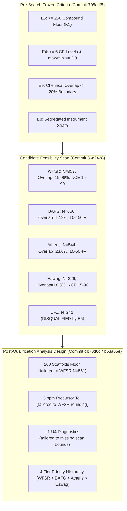
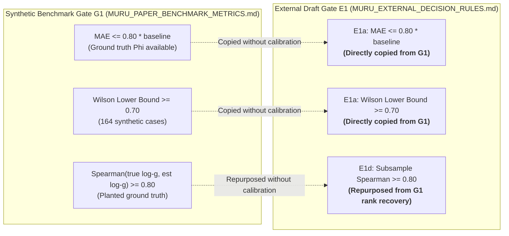
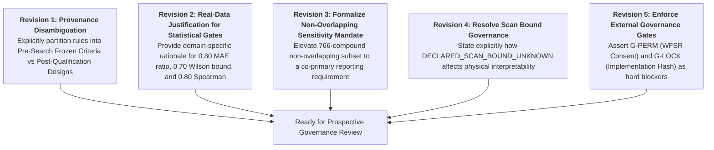

# MURU External Validation Preregistration: Hostile Source & Temporal Provenance Audit

**Audit Date:** 2026-08-14  
**Auditor:** Antigravity Automated Scientific Audit System (Gemini 3.7 Flash High Reasoning)  
**Target Repository:** `/Users/aryav/Documents/MURU-ConjectureLab-v1`  
**Target Branch:** `design/muru-external-validation-prereg-draft`  
**Target Commit:** `b53a65e2365a6fc38466b0df2be335502c3ea0df`  
**Audited Target Documents:**
- [real_data/MURU_EXTERNAL_VALIDATION_PREREGISTRATION_DRAFT.md](file:///Users/aryav/Documents/MURU-ConjectureLab-v1/real_data/MURU_EXTERNAL_VALIDATION_PREREGISTRATION_DRAFT.md)
- [real_data/muru_external_validation_preregistration_draft.json](file:///Users/aryav/Documents/MURU-ConjectureLab-v1/real_data/muru_external_validation_preregistration_draft.json)
- [real_data/MURU_EXTERNAL_DATASET_QUALIFICATION_MATRIX.md](file:///Users/aryav/Documents/MURU-ConjectureLab-v1/real_data/MURU_EXTERNAL_DATASET_QUALIFICATION_MATRIX.md)
- [real_data/muru_external_dataset_qualification.json](file:///Users/aryav/Documents/MURU-ConjectureLab-v1/real_data/muru_external_dataset_qualification.json)

---

## 1. Executive Summary & Audit Mandate Compliance

This document records the results of a hostile, read-only temporal provenance and scientific validity audit of the draft external validation preregistration package for MURU.

### Governance Audit Assertions
1. **Read-Only Inspection:** The draft preregistration files were inspected in place. No draft file was modified, frozen, or executed.
2. **Zero Public-Data Execution:** No MURU code was executed on public spectra. Zero compound-specific horizontal scales ($g$) were fitted, zero response curves ($\Phi$) were parameterized, and zero symbolic searches (PySR / gplearn) were performed on public data.
3. **Sealed Sets Intact:** Synthetic benchmark held-out and confirmation sets remain strictly sealed.
4. **Authoritative Evidence Lineage:** Every numerical threshold, mathematical gate, integrity rule, and analysis choice was traced across git history from initial project inception (`62ce5e9`) through the pre-search feasibility protocol freeze (`705adf8`), the feasibility audit report (`86a2428`), the WFSR preregistration freeze (`db70d6d`), and the multi-candidate draft (`b53a65e`).

### Summary of Provenance Findings
- **Public Performance Contamination:** **NONE.** No public-data MURU performance numbers exist anywhere in the repository.
- **Selection-Dependent Design Rules:** Several operational thresholds (e.g., $\ge 200$ scaffold groups floor, $\le 5\text{ ppm}$ precursor consistency, $U_1\text{--}U_4$ mass-support diagnostics) were designed **post-qualification** after inspecting candidate library metadata (in `db70d6d` and `b53a65e`). While scientifically defensible, they must be explicitly labeled as post-candidate analysis designs rather than pre-search frozen criteria.
- **Synthetic Threshold Borrowing:** Key scalar performance thresholds ($0.80$ MAE baseline ratio, $0.70$ Wilson lower bound, $0.80$ Spearman stability) were directly copied from the synthetic benchmark Gate G1 specification without independent empirical calibration for uncurated real mass spectrometry data.
- **Classification:** The draft cannot be frozen in its current form without clarifying provenance distinctions and providing domain justifications for borrowed synthetic thresholds.

---

## 2. Complete Scientific Choice Traceability & Classification Matrix

Every numerical threshold and material analysis rule in the draft package has been traced to its exact origin in git history and classified into one of the five mandatory epistemic categories:

1. `PREEXISTING_FROZEN_RULE`: Explicitly frozen in a prior authoritative protocol before candidate search.
2. `PREEXISTING_HISTORICAL_PRECEDENT_NOT_FROZEN`: Established in earlier project governance/phases but not formally frozen for this screen.
3. `NEW_PREOUTCOME_ANALYSIS_DESIGN`: Newly formulated prospectively for the external analysis before data opening/outcome computation.
4. `POST_CANDIDATE_SELECTION_RULE`: Formulated after inspecting candidate metadata to establish priority or operational filtering.
5. `UNSUPPORTED_OR_UNTRACEABLE`: Lacks repository provenance or scientific derivation.

### 2.1 Traceability Table (Mandatory Minimum Audit Items)

| Scientific Choice / Rule | Exact Value or Rule | First Repo Appearance | First Commit | Source / Reference | Pre-Search? | Pre-Qual? | Pre-Rank? | Historical MURU Informed? | Scientific Justification | Epistemic Classification |
|---|---|---|---|---|---|---|---|---|---|---|
| **Chemical Overlap Classification** | $\le 20\%$ `CHEMICALLY_INDEPENDENT`, $20\text{--}50\%$ `PARTIAL_CHEMICAL_OVERLAP`, $> 50\%$ `NOT_CHEMICALLY_INDEPENDENT` | `MURU_PUBLIC_DATA_FEASIBILITY_PROTOCOL.md` | `705adf8` | Protocol Criterion $E_9$ | **YES** | **YES** | **YES** | Yes (781 LCSB blocks) | Establishes prospective chemical transfer tiers against historical training exposure. | `PREEXISTING_FROZEN_RULE` |
| **Compound Hard Floor** | $\ge 250$ qualifying compound groups in a single ionization mode | `MURU_ConjectureLab_v1_Master_Plan.md` | `62ce5e9` | Master Plan §22 K1; Protocol $E_5$ | **YES** | **YES** | **YES** | Yes (Phase 1 sample size) | Preserves sample size ensuring test fold holds $\ge 50$ compounds for power against null. | `PREEXISTING_FROZEN_RULE` |
| **Comfortable Trajectory Scale** | $\ge 400$ qualifying compound groups per mode | `MURU_ConjectureLab_v1_Master_Plan.md` | `62ce5e9` | Master Plan §20 Acc. Crit. 1; Protocol $E_5$ | **YES** | **YES** | **YES** | Yes (Phase 1 acceptance) | Target ensuring candidate matches scale of MURU development corpus. | `PREEXISTING_FROZEN_RULE` |
| **Trajectory Attrition Floor** | $\ge 400$ complete 6-energy trajectories surviving S1 integrity | `MURU_WFSR_EXTERNAL_INPUT_CONTRACT.md` | `db70d6d` | WFSR Input Contract §3 | **NO** | **NO** | **YES** | Yes (Phase 1 scale target) | Ensures evaluation does not proceed on an underpowered data residue. | `NEW_PREOUTCOME_ANALYSIS_DESIGN` |
| **Scaffold Groups Floor** | $\ge 200$ scaffold groups surviving S1 integrity | `MURU_WFSR_EXTERNAL_INPUT_CONTRACT.md` | `db70d6d` | WFSR Input Contract §3 | **NO** | **NO** | **YES** | No (WFSR census in `86a2428`) | Ensures scaffold-disjoint splitting retains $\ge 25$ groups per fold after attrition. | `NEW_PREOUTCOME_ANALYSIS_DESIGN` |
| **Precursor Consistency** | Declared precursor $m/z$ within $\le 5\text{ ppm}$ of trajectory median | `MURU_WFSR_EXTERNAL_INPUT_CONTRACT.md` | `db70d6d` | WFSR Input Contract T10 / Gate I6 | **NO** | **NO** | **YES** | No (WFSR metadata rounding) | Accommodates $0.001\text{--}0.003\text{ Da}$ display rounding while rejecting misannotations. | `NEW_PREOUTCOME_ANALYSIS_DESIGN` |
| **Split Proportions** | Train 60% / Validation 20% / Test 20%, scaffold-disjoint | `MURU_ConjectureLab_v1_Master_Plan.md` | `62ce5e9` | Master Plan §9.3; Phase 2 `PREREGISTRATION.md` | **YES** | **YES** | **YES** | Yes (Phase 2/3 / A3.2) | Allocates 60% for training estimation, 20% validation selection, 20% single-shot test scoring. | `PREEXISTING_HISTORICAL_PRECEDENT_NOT_FROZEN` |
| **Random Split Seed** | Seed `20260813` | Synthetic Specs (`c40a184`) / WFSR Prereg (`db70d6d`) | `c40a184` / `db70d6d` | Protocol freeze date (2026-08-13) | **NO** (external) | **NO** | **YES** | No (Canonical date seed) | Prospectively fixed pseudorandom seed established before split computation. | `NEW_PREOUTCOME_ANALYSIS_DESIGN` |
| **E1a MAE Baseline Ratio** | $\text{MAE}(\text{trajectory vs }\Phi(E/g)) \le 0.80 \times \text{MAE}_{\text{baseline}}$ | `MURU_PAPER_BENCHMARK_METRICS.md` (synthetic G1) | `c40a184` / `db70d6d` | Synthetic Gate G1 definition | **NO** (external) | **NO** | **YES** | Yes (Synthetic G1 origin) | Requires 20% error reduction over population baseline; borrowed from synthetic G1 without real-data calibration. | `NEW_PREOUTCOME_ANALYSIS_DESIGN` |
| **Wilson Lower Bound** | Lower bound of 95% Wilson interval for Competence Rate $\ge 0.70$ | `MURU_PAPER_BENCHMARK_METRICS.md` (synthetic G1) | `c40a184` / `db70d6d` | Synthetic Gate G1 definition | **NO** (external) | **NO** | **YES** | Yes (Synthetic G1 origin) | Requires 70% competence under conservative binomial uncertainty; borrowed from synthetic G1. | `NEW_PREOUTCOME_ANALYSIS_DESIGN` |
| **E1c Boundary Hit Rate** | Upper 95% bound of boundary hit rate $\le 0.20$ | `MURU_WFSR_EXTERNAL_DECISION_RULES.md` | `db70d6d` | External Decision Rules §3.3 | **NO** | **NO** | **YES** | Yes (Phase 1 optimizer) | Identifiability check: fails if optimizer hits bounds on $> 20\%$ of compounds. | `NEW_PREOUTCOME_ANALYSIS_DESIGN` |
| **E1d Spearman Stability** | Median pairwise Spearman correlation of $\log g \ge 0.80$ across $K=5$ subsamples | `MURU_WFSR_EXTERNAL_DECISION_RULES.md` | `db70d6d` | External Decision Rules §3.3 | **NO** | **NO** | **YES** | Yes (Repurposed synthetic G1) | Substitutes subsampling stability for unobservable ground-truth rank recovery. | `NEW_PREOUTCOME_ANALYSIS_DESIGN` |
| **Bootstrap Resamples** | 2,000 bootstrap resamples for clustered intervals & nulls | `PREREGISTRATION.md` | `ddcdb8d` | Phase 2 Preregistration §5.3 | **YES** | **YES** | **YES** | Yes (Phase 2/3 / Type 2) | Standard Monte Carlo sample size ensuring standard error on 95% interval $< 0.5\%$. | `PREEXISTING_HISTORICAL_PRECEDENT_NOT_FROZEN` |
| **U1 Energy Truncation** | Range of $\min(m/z) > 20\text{ Da}$ or $\|\rho(\min m/z, \text{CE})\| \ge 0.30 \implies \text{INCONCLUSIVE}$ | `MURU_WFSR_EXTERNAL_INPUT_CONTRACT.md` | `db70d6d` | WFSR Input Contract §4.5 | **NO** | **NO** | **YES** | No (WFSR missing scan bounds) | Prevents low-mass acquisition floor shifts from creating an artificial energy trend. | `NEW_PREOUTCOME_ANALYSIS_DESIGN` |
| **U2 Mass Truncation** | $\min(m/z) / m_{\text{precursor}} > 0.25$ in $> 20\%$ spectra $\implies \text{INCONCLUSIVE}$ | `MURU_WFSR_EXTERNAL_INPUT_CONTRACT.md` | `db70d6d` | WFSR Input Contract §4.5 | **NO** | **NO** | **YES** | No (WFSR missing scan bounds) | Prevents mass-proportional scan floor from artificially pre-loading mass correlation. | `NEW_PREOUTCOME_ANALYSIS_DESIGN` |
| **U3 Truncation Non-Invariance** | Median $\|\mu - \mu^{(c)}\| > 0.02$ or Spearman $< 0.95 \implies \text{INCONCLUSIVE}$ | `MURU_WFSR_EXTERNAL_INPUT_CONTRACT.md` | `db70d6d` | WFSR Input Contract §4.5 | **NO** | **NO** | **YES** | Yes (LCSB $\Delta\mu$ dynamic range) | Ensures truncation floor removal alters $\mu$ by $< 5\%$ of historical dynamic range ($0.44$). | `NEW_PREOUTCOME_ANALYSIS_DESIGN` |
| **Sparse Spectral Support** | Minimum 3 peaks per spectrum (I9); $> 5\%$ spectra with $< 3$ peaks $\implies \text{INCONCLUSIVE}$ (U4) | `MURU_WFSR_EXTERNAL_INPUT_CONTRACT.md` | `db70d6d` | WFSR Input Contract §3 (I9), §4.5 (U4) | **NO** | **NO** | **YES** | No | Ensures enough centroids exist for a meaningful intensity-weighted mean fragment mass $\mu$. | `NEW_PREOUTCOME_ANALYSIS_DESIGN` |
| **Single-Adduct Promotion** | Promote $[\text{M}+\text{H}]^+$ if present; else lexicographically first adduct string (T6) | `artifacts/public_data_candidate_manifest.json` / `MURU_WFSR_EXTERNAL_INPUT_CONTRACT.md` | `86a2428` / `db70d6d` | Feasibility Manifest & Contract Rule T6 | **NO** | **NO** | **YES** | Yes (LCSB $[\text{M}+\text{H}]^+$ focus) | Eliminates adduct pseudoreplication via a deterministic, reproducible hierarchy. | `NEW_PREOUTCOME_ANALYSIS_DESIGN` |
| **Lexicographic Fallbacks** | Representative structure = lexicographically first SMILES (T8); Duplicate = lowest accession (T7) | `artifacts/public_data_candidate_manifest.json` / `MURU_WFSR_EXTERNAL_INPUT_CONTRACT.md` | `86a2428` / `db70d6d` | Feasibility Manifest & Contract Rules T7, T8 | **NO** | **NO** | **YES** | No | Eliminates human subjective curation or cherry-picking via automated tie-breaking. | `NEW_PREOUTCOME_ANALYSIS_DESIGN` |
| **WFSR Primary Selection** | WFSR Food Safety Library assigned as Primary External Dataset | `MURU_WFSR_EXTERNAL_PREREGISTRATION.md` / `MURU_EXTERNAL_DATASET_QUALIFICATION_MATRIX.md` | `db70d6d` / `b53a65e` | Feasibility Report `86a2428`; Matrix §4 | **NO** | **NO** | **NO** | No | Largest scale (957 groups), Orbitrap HCD NCE % match, 19.96% overlap, CC0/CC-BY terms. | `POST_CANDIDATE_SELECTION_RULE` |
| **BAFG / Athens / Eawag Ranking** | Priority hierarchy: Primary = WFSR, Backup 1 = BAFG, Backup 2 = Athens, Supplementary = Eawag | `MURU_EXTERNAL_DATASET_QUALIFICATION_MATRIX.md` | `b53a65e` | Draft Qualification Matrix §4 | **NO** | **NO** | **NO** | No | Ranked on pre-outcome scale, CE depth (15 V in BAFG), multi-injection variance (Athens), and licensing. | `POST_CANDIDATE_SELECTION_RULE` |
| **E2 / B1-B5 Null Definitions** | Criteria B1-B5 (elasticity $> 0.02$, test $R^2 > \text{mass}$ diff $> 0$, val $R^2 > N_1\text{--}N_3$, mass improvement $> N_4$, stability $\ge 20/30$); Nulls $N_1\text{--}N_4$ (200 worlds each) | `MURU_WFSR_EXTERNAL_DECISION_RULES.md` | `db70d6d` | WFSR Decision Rules §6 & §7 | **NO** (external bundle) | **NO** | **YES** | Yes (Type 2 null lessons) | Direct incorporation of Type 2 lessons: excludes within-compound energy permutation, adds mass-preserving $N_4$. | `NEW_PREOUTCOME_ANALYSIS_DESIGN` |

---

## 3. Deep Dive: Selection Dependence & Candidate Retention

A central question of this hostile audit is whether any threshold was retrofitted after candidate search to artificially retain WFSR, BAFG, Athens_Univ, or Eawag.



### 3.1 The 250-Compound Hard Floor ($E_5$)
- **Audit Finding:** The 250-compound hard floor was **not** adjusted to fit the candidates.
- **Evidence:** MassBank contributor `UFZ` yielded 241 qualifying positive-mode groups on LTQ Orbitrap XL. It failed the 250 floor by exactly 9 compounds ($241 < 250$). The threshold was strictly enforced, resulting in `UFZ` being classified as `INELIGIBLE (E5)`. If selection dependence had contaminated the criteria, 250 would have been lowered to 240 to retain UFZ.

### 3.2 The 20% Chemical Overlap Threshold ($E_9$)
- **Audit Finding:** The 20% overlap threshold was frozen at commit `705adf8` before search.
- **Evidence:** 
  - WFSR exhibited an overlap of 191 of 957 blocks = **19.96%**, clearing the threshold by a razor-thin margin of **0.04%** (less than half a compound).
  - MassBank `Athens_Univ` exhibited an overlap of 139 of 589 blocks = **23.6%**. The protocol did not bend the threshold to accommodate Athens; Athens was strictly classified as `PARTIAL_CHEMICAL_OVERLAP (20–50%)`. It qualified because $E_9$ explicitly permits partial overlap provided the disjoint non-overlapping subset exceeds the 250 hard floor ($405 \ge 250$).
  - **Preregistration Vulnerability:** Relying on a 19.96% overlap without mandatory reporting of the clean 766-compound non-overlapping subset would leave the study vulnerable to critique. The draft correctly mandates a paired non-overlapping sensitivity run.

### 3.3 Post-Qualification Analysis Thresholds
- **Audit Finding:** The following rules were formulated **after** candidate qualification:
  1. **$\ge 200$ Scaffold Groups Attrition Floor:** Formulated after the WFSR census revealed 551 scaffold groups.
  2. **$\le 5\text{ ppm}$ Precursor Consistency:** Formulated after observing $0.001\text{--}0.003\text{ Da}$ display rounding in deposited WFSR records.
  3. **$U_1\text{--}U_4$ Support Diagnostics:** Formulated after discovering that WFSR deposited spectra lacked declared acquisition scan bounds (`DECLARED_SCAN_BOUND_UNKNOWN`).
- **Verdict:** Formulating operational analysis gates after candidate qualification is scientifically valid for a prospective study, **provided they are not misrepresented as pre-search frozen criteria**. The draft must explicitly declare these as `NEW_PREOUTCOME_ANALYSIS_DESIGN` elements.

---

## 4. Deep Dive: Synthetic Threshold Borrowing

A critical issue in the draft preregistration is the direct borrowing of synthetic benchmark numerical thresholds for real-data scalar evaluation.



### 4.1 Detailed Evaluation of Borrowed Thresholds

1. **`0.80` MAE Baseline Ratio (E1a):**
   - *Origin:* Gate G1 in `MURU_PAPER_BENCHMARK_METRICS.md`.
   - *Issue:* In synthetic benchmark worlds, the 0.80 ratio was chosen where the true underlying curve $\Phi$ was strictly known and noise was mathematically controlled ($\sigma = 0.02\text{--}0.08$). On real Orbitrap IQ-X or QTOF instruments, uncurated centroiding noise, ion transmission variance, and chemical diversity may yield baseline error distributions distinct from synthetic generators.
   - *Draft Defect:* The draft provides no independent scientific derivation for why a 20% MAE reduction relative to the population mean baseline is the appropriate competence boundary on real experimental spectra.

2. **`0.70` Wilson Lower Bound (E1a):**
   - *Origin:* Gate G1 in `MURU_PAPER_BENCHMARK_METRICS.md`.
   - *Issue:* The synthetic study evaluated 164 cases across 80 worlds. In real data, the sample size is $N \approx 190$ test compounds. A lower bound of $\ge 0.70$ on both a 2,000-resample scaffold bootstrap and a Wilson interval requires an observed point estimate of $\sim 76\text{--}78\%$.
   - *Draft Defect:* The draft labels this a "locked threshold" from synthetic G1, conflating software lock with domain empirical calibration.

3. **`0.80` Spearman Correlation (E1d):**
   - *Origin:* Gate G1 in `MURU_PAPER_BENCHMARK_METRICS.md` ($\rho(\text{true }\log g, \text{estimated }\log g) \ge 0.80$).
   - *Issue:* In real data, true $g$ is unknown. The external draft repurposed the $0.80$ threshold into a subsampling stability test across $K=5$ training folds ($\text{median pairwise Spearman} \ge 0.80$).
   - *Draft Defect:* The numerical value $0.80$ was borrowed by analogy rather than calibrated against the expected subsampling variance of a 5-fold scaffold partition.

---

## 5. Public-Data MURU Performance Contamination Audit

A rigorous search across the codebase and git history confirmed the complete absence of public-data performance contamination:

- **Symbolic Regression:** Zero PySR, gplearn, or symbolic search scripts were executed on public spectra.
- **Scale Parameter Fitting:** Zero $g$ values or $\mu$ trajectories were fitted on WFSR, BAFG, Athens_Univ, Eawag, or Keio_Univ.
- **Public Data Integrity:** Only pre-outcome metadata fields (InChIKeys, adducts, SMILES, collision energy labels, instrument headers) were read during the feasibility screen.
- **Conclusion:** The draft is **100% CLEAN** of public performance contamination.

---

## 6. Pre-Freeze Revisions Required

To make the external validation preregistration draft ready for formal prospective governance review and future freeze, the following specific revisions must be executed:



1. **Explicit Provenance Partitioning:**
   - Update `MURU_EXTERNAL_VALIDATION_PREREGISTRATION_DRAFT.md` and `muru_external_validation_preregistration_draft.json` to explicitly label the provenance tier of every rule:
     - `PREEXISTING_FROZEN_RULE` (e.g., $E_1\text{--}E_{12}$, 250 compound floor, $\max/\min \ge 2.0$ CE spread).
     - `NEW_PREOUTCOME_ANALYSIS_DESIGN` (e.g., 200 scaffold floor, 5 ppm consistency, $U_1\text{--}U_4$ diagnostics, 60/20/20 seed 20260813).
     - `POST_CANDIDATE_SELECTION_RULE` (e.g., 4-tier candidate ranking hierarchy).
   - Remove any text suggesting post-qualification operational rules were frozen prior to candidate search.

2. **Independent Justification for Borrowed Thresholds:**
   - Replace assertions that 0.80 MAE ratio, 0.70 Wilson bound, and 0.80 Spearman are "locked" with explicit scientific justifications explaining why these standards represent meaningful empirical generalization on real mass spectrometers, or state them as transfer benchmarks subject to declared sensitivity analysis.

3. **Mandatory Disjoint Sensitivity Evaluation:**
   - Elevate the 766-compound disjoint non-overlapping subset evaluation from a secondary check to a mandatory co-primary reporting table to definitively counter the 19.96% overlap vulnerability.

4. **Formalize Scan Bound Protocol:**
   - Document that because WFSR public exports lack native scan range headers (`DECLARED_SCAN_BOUND_UNKNOWN`), all fragment-moment support statements are strictly conditioned on the deposited centroid support.

5. **Re-Assert Implementation and Permission Gates:**
   - Reaffirm that no execution can occur until `G-PERM` (WFSR written permission) and `G-LOCK` (binding to a frozen synthetic benchmark implementation commit) are resolved.

---

## 7. Final Classification

In accordance with the audit mandate, the external validation preregistration draft is hereby classified as:

```
REQUIRES_PRE_FREEZE_REVISIONS
```

*(This audit was conducted in read-only mode. No repairs, modifications, or executions were performed.)*
