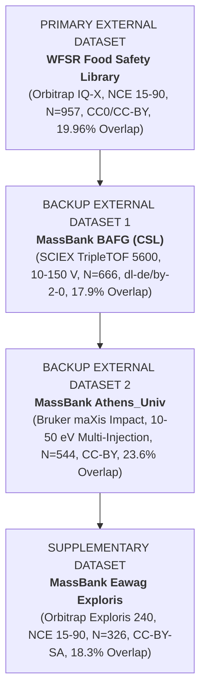

# MURU External Dataset Qualification Matrix

**Status:** `DRAFT — FROZEN DESIGN ONLY — DO NOT EXECUTE`  
**Date:** 2026-08-14  
**Authoritative Protocol Basis:** [MURU_PUBLIC_DATA_FEASIBILITY_PROTOCOL.md](file:///Users/aryav/Documents/MURU-ConjectureLab-v1/.claude/worktrees/muru-lcmsms-feasibility-1ef59b/MURU_PUBLIC_DATA_FEASIBILITY_PROTOCOL.md) (commit `705adf8`)  
**Authoritative Feasibility Report:** [MURU_PUBLIC_DATA_FEASIBILITY_REPORT.md](file:///Users/aryav/Documents/MURU-ConjectureLab-v1/.claude/worktrees/muru-lcmsms-feasibility-1ef59b/MURU_PUBLIC_DATA_FEASIBILITY_REPORT.md)  
**Exposure Baseline:** [artifacts/public_data_exposure_set.json](file:///Users/aryav/Documents/MURU-ConjectureLab-v1/.claude/worktrees/muru-lcmsms-feasibility-1ef59b/artifacts/public_data_exposure_set.json) (781 unique InChIKey blocks from LCSB MassBank release `2026.03` / MassIVE `MSV000091754`)

---

## 1. Executive Summary & Governance Assertion

This document establishes the frozen prospective qualification matrix for candidate public LC-MS/MS datasets evaluated for future external validation of MURU. 

> [!IMPORTANT]
> **GOVERNANCE ASSERTION:**
> - **NO REAL-DATA MURU SYMBOLIC SEARCH HAS BEEN EXECUTED.**
> - **NO PUBLIC-DATA PERFORMANCE OR SCALAR FIT HAS BEEN CALCULATED.**
> - **NO SYNTHETIC BENCHMARK OUTCOMES OR SEALED CONFIRMATION SETS WERE INSPECTED.**
> - All evaluations in this matrix rely strictly on pre-outcome metadata, physical instrument attributes, provenances, and structural identifiers.

---

## 2. Field-Level Epistemic Classification Rules

Every metadata field for every candidate is prospectively classified using the project's strict epistemic taxonomy:

- **`VERIFIED`**: Directly observed and validated in primary deposited records, raw file headers, or authoritative repository manifests.
- **`PARTIALLY_VERIFIED`**: Present with high confidence via primary publication methods or author citations, but requiring a labeled assumption or missing direct in-record tagging.
- **`MISSING`**: Field is absent, unpopulated, zero-filled, or unresolvable from public records.
- **`NOT_APPLICABLE`**: Field does not apply to the specific acquisition mode or platform.

---

## 3. Comprehensive Candidate Qualification Matrix

### 3.1 Primary Eligible Candidates (Cleared Feasibility Screen)

| Metadata Field | WFSR Food Safety Library | MassBank BAFG (CSL) | MassBank Athens_Univ | MassBank Eawag (Level 1 Stratum) |
|---|---|---|---|---|
| **Candidate ID** | `wfsr_food_safety_library` | `massbank_bafg_csl` | `massbank_athens_univ` | `massbank_eawag_exploris` |
| **Repository** | GNPS2 / MassIVE / WUR (`VERIFIED`) | MassBank Europe / GitHub (`VERIFIED`) | MassBank Europe / GitHub (`VERIFIED`) | MassBank Europe / GitHub (`VERIFIED`) |
| **Dataset / Accession** | GNPS `WFSR-LIBRARY` (`CCMSLIB00013933782`–`774`), MassIVE `MSV000098571` (`VERIFIED`) | MassBank `BAFG`, release `2026.03`, commit `705afb7b` (`VERIFIED`) | MassBank `Athens_Univ`, release `2026.03`, commit `705afb7b` (`VERIFIED`) | MassBank `Eawag` (`EA`/`EQ`), release `2026.03`, commit `705afb7b` (`VERIFIED`) |
| **Associated Publication** | Padilla-Gonzalez et al., *Anal. Chem.* 2025, DOI: `10.1021/acs.analchem.5c03020` (`VERIFIED`) | BfG Non-Target Screening literature (`VERIFIED`) | Alygizakis et al., NORMAN Network (`VERIFIED`) | Eawag Environmental Reference Library, RMassBank workflow (`VERIFIED`) |
| **License / Terms** | GNPS CC0; Article CC-BY 4.0; WUR educational/research use terms (`VERIFIED`) | `dl-de/by-2-0` (Data licence Germany attribution 2.0; fully open) (`VERIFIED`) | CC BY (3,588 records) / CC BY-SA (941 records) in qualifying stratum (`VERIFIED`) | CC BY-SA uniformly in qualifying Exploris stratum (`VERIFIED`) |
| **Instrument Family** | Orbitrap Tribrid (`VERIFIED`) | QTOF (`VERIFIED`) | QTOF (`VERIFIED`) | Orbitrap (`VERIFIED`) |
| **Instrument Model** | Thermo Scientific Orbitrap IQ-X Tribrid (`VERIFIED`) | SCIEX TripleTOF 5600 (Primary); 6600 (Secondary) (`VERIFIED`) | Bruker maXis Impact (`VERIFIED`) | Thermo Scientific Orbitrap Exploris 240 (`VERIFIED`) |
| **Mass Analyzer Type** | Orbitrap FTMS (`VERIFIED`) | Quadrupole-Time-of-Flight (`VERIFIED`) | Quadrupole-Time-of-Flight (`VERIFIED`) | Orbitrap FTMS (`VERIFIED`) |
| **Fragmentation Mode** | HCD (Higher-energy C-trap Dissociation) (`PARTIALLY_VERIFIED` - publication) | Beam-type CID (Collision-Induced Dissociation) (`VERIFIED`) | Beam-type CID (`VERIFIED`) | HCD (`VERIFIED` in record headers) |
| **Ionization Mode** | Positive ESI (`VERIFIED`) | Positive and Negative ESI (`VERIFIED`) | Positive and Negative ESI (`VERIFIED`) | Positive and Negative ESI (`VERIFIED`) |
| **Analysis Polarity** | Positive (`VERIFIED`) | Positive (Primary stratum); Negative (Secondary) (`VERIFIED`) | Positive (`VERIFIED`) | Positive (`VERIFIED`) |
| **CE Representation** | Class C: In-record NAME suffix (`_CE15`..`_CE90`), NCE % convention in publication (`PARTIALLY_VERIFIED`) | Class A/C: Bare integer in `COLLISION_ENERGY`, unit `V` in `RECORD_TITLE` (`VERIFIED`) | Class A: Explicit unit-bearing string `"20 eV"` in `COLLISION_ENERGY` field (`VERIFIED`) | Class B: Explicit string `"15 % (nominal)"` in `COLLISION_ENERGY` field (`VERIFIED`) |
| **CE Units** | Normalized Collision Energy (%) (`PARTIALLY_VERIFIED` - labeled assumption) | Laboratory-frame collision cell potential (V) (`VERIFIED`) | Laboratory-frame collision energy (eV) (`VERIFIED`) | Normalized Collision Energy (%) (`VERIFIED`) |
| **Number of Usable CE Levels** | 6 discrete levels (`15, 30, 45, 60, 75, 90`) (`VERIFIED`) | 15–16 discrete levels (`10, 20, 30, 40, ..., 150 V`) (`VERIFIED`) | Exactly 5 discrete levels (`10, 20, 30, 40, 50 eV`) (`VERIFIED`) | 6–10 discrete levels (`15, 30, 45, 60, 75, 90 + higher`) (`VERIFIED`) |
| **CE Ratio (max/min)** | $90 / 15 = 6.0 \ge 2.0$ (`VERIFIED`) | $150 / 10 = 15.0 \ge 2.0$ (`VERIFIED`) | $50 / 10 = 5.0 \ge 2.0$ (`VERIFIED`) | $90 / 15 = 6.0 \ge 2.0$ (`VERIFIED`) |
| **Qualifying Groups (14-char Block)** | **957** (Positive) (`VERIFIED`) | **666** (TripleTOF 5600 Pos); 331 (6600 Pos); 247 (5600 Neg) (`VERIFIED`) | **544** (maXis Pos); 23 (maXis Neg); 42 (GC-APCI Pos) (`VERIFIED`) | **326** (Exploris 240 Pos); 311 (LTQ XL Pos); 142 (Exploris Neg) (`VERIFIED`) |
| **Qualifying Groups (27-char InChIKey)** | **998** (Positive) (`VERIFIED`) | **670** (TripleTOF 5600 Pos) (`VERIFIED`) | **547** (maXis Pos) (`VERIFIED`) | **326** (Exploris 240 Pos) (`VERIFIED`) |
| **Identity Quality Tier** | Level 1 Authentic Commercial Reference Standard (1,001) (`VERIFIED`) | Level 1 Reference Standard (20,658 / 20,658 records carry Level 1 confidence) (`VERIFIED`) | Standard compound (5,520) + Level 1 Reference Standard (113) (`VERIFIED`) | Level 1 Reference Standard (18,332 records; annotation tiers strictly filtered out) (`VERIFIED`) |
| **Replicate Structure** | Single DDA injection per compound (0 within-run multi-injection variance; 192 duplicate cells) (`VERIFIED`) | Single-injection fast CE switching (RT constant across 15 energies in 909/913 groups; 1,471 2-replicate cells) (`VERIFIED`) | **Separate chromatographic injections per CE setting** (RT varies across energies in 504/567 groups) (`VERIFIED`) | Single injection per compound (RT constant across energies in 464/468 groups) (`VERIFIED`) |
| **Precursor / Adduct Handling** | Stratified: `[M+H]+` (6,764 records), `[M+NH4]+` (154), `[M+Na]+` (68), `[M+2H]+` (7). Primary: `[M+H]+` (`VERIFIED`) | Stratified: Predominantly `[M+H]+` (Pos) and `[M-H]-` (Neg) (`VERIFIED`) | Stratified: Predominantly `[M+H]+` (`VERIFIED`) | Stratified: Predominantly `[M+H]+` (`VERIFIED`) |
| **Spectral Format** | Processed MSP, MGF, JSON peak lists; raw on MassIVE `MSV000098571` (`VERIFIED`) | MassBank record format with full centroid peak lists (`VERIFIED`) | MassBank record format with full centroid peak lists & RMassBank provenance (`VERIFIED`) | MassBank record format with full centroid peak lists & RMassBank provenance (`VERIFIED`) |
| **Metadata Completeness** | High (Structure, Adduct, Precursor m/z, CE in NAME); Scan bounds missing (`PARTIALLY_VERIFIED`) | High (Structure, Adduct, Precursor m/z, CE, Title); Processing method implicit (`PARTIALLY_VERIFIED`) | Complete (Structure, Adduct, Precursor m/z, Explicit CE unit, RMassBank) (`VERIFIED`) | Complete (Structure, Adduct, Precursor m/z, Explicit CE unit, RMassBank) (`VERIFIED`) |
| **Prior MURU Exposure** | `CLEAN` / `UNEXPOSED` (Never accessed in Phase 1, Phase 2, Phase 3, or Type 2) (`VERIFIED`) | `CLEAN` / `UNEXPOSED` (Never accessed during MURU development) (`VERIFIED`) | `CLEAN` / `UNEXPOSED` (Never accessed during MURU development) (`VERIFIED`) | `CLEAN` / `UNEXPOSED` (Never accessed during MURU development) (`VERIFIED`) |
| **Chemical Overlap with MURU Dev** | 191 of 957 blocks = **19.96%** (`CHEMICALLY_INDEPENDENT` $\le 20\%$) (`VERIFIED`) | 200 of 1,119 unique blocks = **17.9%** (`CHEMICALLY_INDEPENDENT` $\le 20\%$) (`VERIFIED`) | 139 of 589 unique blocks = **23.6%** (`PARTIAL_CHEMICAL_OVERLAP` $20\text{--}50\%$) (`VERIFIED`) | 253 of 1,383 unique blocks = **18.3%** (`CHEMICALLY_INDEPENDENT` $\le 20\%$) (`VERIFIED`) |
| **Clean Non-Overlapping Subset** | **766 qualifying groups** (`VERIFIED`) | **> 500 qualifying groups** in 5600 Pos (`VERIFIED`) | **405 qualifying groups** (`VERIFIED`) | **> 250 qualifying groups** in Exploris Pos (`VERIFIED`) |
| **Known Preprocessing Requirements** | Regex name-suffix extraction for CE; base cell filtering (rel cutoff 0.0, precursor included) (`VERIFIED`) | Record title regex extraction for CE unit; integer CE parsing (`VERIFIED`) | Explicit string parsing (`"XX eV"`); exclude ramped records (`VERIFIED`) | String parsing (`"XX % (nominal)"`); filter to Reference Standard Level 1 (`VERIFIED`) |
| **Feasibility Verdict** | **ELIGIBLE** (`VERIFIED`) | **ELIGIBLE** (`VERIFIED`) | **ELIGIBLE** (`VERIFIED`) | **ELIGIBLE** (`VERIFIED`) |

---

### 3.2 Candidate Requiring Further Qualification

| Metadata Field | MassBank Keio_Univ |
|---|---|
| **Candidate ID** | `massbank_keio_univ` |
| **Repository** | MassBank Europe / GitHub (`VERIFIED`) |
| **Accession / Release** | Directory `Keio_Univ`, prefix `KO`, release `2026.03` (`VERIFIED`) |
| **Instrument Platform** | Applied Biosystems API3000 (4,265 records, LC-ESI-QQ) & Agilent LC/MSD Trap XCT (515 records, LC-ESI-IT) (`VERIFIED`) |
| **License / Terms** | CC BY-NC-SA (Non-Commercial, Share-Alike restriction) (`VERIFIED`) |
| **CE Representation** | Class A ("10 V") on API3000 (`VERIFIED`) |
| **CE Levels** | $\ge 5$ discrete levels (`10, 20, 30, 40, 50 V`) (`VERIFIED`) |
| **Qualifying Groups (Any Identity)** | 419 (API3000 Positive); 352 (API3000 Negative) (`VERIFIED`) |
| **Identity Confidence Field** | `MISSING` (No `COMMENT: CONFIDENCE` field in any of the 4,780 records) |
| **Fragmentation Mode Field** | `MISSING` (No fragmentation mode declared in records) |
| **MS Level Separation** | Contains MS2 (4,420 records), MS3 (290 records), MS4 (70 records) requiring segregation (`PARTIALLY_VERIFIED`) |
| **Prior MURU Exposure** | `CLEAN` (`VERIFIED`) |
| **Open Qualification Blocker** | Criterion $E_2$: Reference-standard grade cannot be established from record metadata alone without external publication verification. Criterion $E_{10}$: CC BY-NC-SA imposes redistribution restrictions on derived numeric evaluation tables. |
| **Feasibility Verdict** | **POTENTIALLY_ELIGIBLE_REQUIRES_FURTHER_QUALIFICATION** |

---

### 3.3 Definitively Ineligible Candidates Accounting (Feasibility Screen)

| # | Candidate ID | Repository / Accession | Instrument | Disqualification Criterion & Rationale |
|---|---|---|---|---|
| 6 | `massbank_ufz` | MassBank `UFZ` | LTQ Orbitrap XL (Thermo) | **INELIGIBLE ($E_5$):** 241 qualifying positive groups, failing the 250 hard floor by 9 groups. |
| 7 | `massbank_natoxaq` | MassBank `NaToxAq` | LTQ Orbitrap XL (Thermo) | **INELIGIBLE ($E_5$):** 117 qualifying positive groups < 250 floor (narrow chemical space). |
| 8 | `massbank_hbm4eu` | MassBank `HBM4EU` | LTQ Orbitrap XL (Thermo) | **INELIGIBLE ($E_5$):** 112 qualifying positive groups < 250 floor. |
| 9 | `massbank_mfam` | MassBank `mFam` | Multi-platform Q Exactive | **INELIGIBLE ($E_5, E_8$):** 178 groups < 250 floor; mixed unstratified platforms without fragmentation metadata. |
| 10 | `massbank_aafc` | MassBank `AAFC` | Q Exactive Orbitrap | **INELIGIBLE ($E_5$):** 102 groups < 250 floor; 244 records derived from biological extracts. |
| 11 | `massbank_riken` | MassBank `RIKEN` | Multi-instrument QTOF/Orbitrap | **INELIGIBLE ($E_4$):** 0 qualifying groups (1,015 ramped Class D spectra, NPDepo lacks CE). |
| 12 | `massbank_fac_eng_tokyo`| MassBank `Fac_Eng_Univ_Tokyo`| Multi-instrument | **INELIGIBLE ($E_3$ Class F):** 11,719 / 12,379 records have absent CE metadata. |
| 13 | `massbank_aces_su` | MassBank `ACES_SU` | Multi-instrument | **INELIGIBLE ($E_3$ Class D):** 1,507 / 1,778 records are stepped/ramped merged acquisitions. |
| 14 | `massbank_entact_agilent`| MassBank `ENTACT_AGILENT` | Agilent QTOF | **INELIGIBLE ($E_4, E_8$):** 0 qualifying groups; `AC$INSTRUMENT` reads "N/A" on all records. |
| 15 | `massbank_lcsb` | MassBank `LCSB` | Q Exactive Orbitrap | **INELIGIBLE ($E_9$):** Contaminated (Historical MURU development training set; used as scanner control). |
| 16 | `massive_msv000091754` | MassIVE `MSV000091754` | Q Exactive Orbitrap | **INELIGIBLE ($E_9$):** Contaminated (Raw companion mzML files for historical MURU development corpus). |
| 17 | `msnlib_zenodo` | Zenodo `10.5281/zenodo.16984129` | Orbitrap ID-X | **INELIGIBLE ($E_4$):** Maximum 4 discrete single-energy levels per precursor (mode: 3), failing $\ge 5$ floor. |
| 18 | `bmdms_np` | GNPS `BMDMS-NP` | Multi-instrument Orbitrap | **INACCESSIBLE_OR_UNVERIFIABLE ($E_3$):** GNPS export leaves `COLLISIONENERGY` empty on all 177,773 records. |
| 19 | `gnps_library_generic` | GNPS2 Library Endpoint | Generic | **INELIGIBLE ($E_3$):** GNPS JSON schema lacks native CE field (loses CE unless encoded in Name). |

---

## 4. Pre-Outcome Dataset Priority Ranking

To prevent post-hoc dataset selection after seeing evaluation outcomes, eligible candidates are prospectively ranked based **strictly on pre-outcome quality, size, CE depth, instrument consistency, and independence factors**:

### 4.1 Primary External Dataset: WFSR Food Safety Mass Spectral Library
- **Selection Rationale:**
  1. **Highest Qualifying Scale:** Largest single qualifying stratum in the public domain (957 positive-mode 6-energy trajectories across 551 scaffold groups).
  2. **Direct Technological Alignment:** Acquired on Thermo Orbitrap IQ-X Tribrid under NCE % (15, 30, 45, 60, 75, 90), directly matching the physical dimension and energy grid of MURU's development platform.
  3. **High Chemical Independence:** 19.96% overlap with MURU development set ($\le 20\%$ threshold, `CHEMICALLY_INDEPENDENT`), providing 766 completely non-overlapping compounds.
  4. **Unambiguous Identity:** 100% authentic commercial standards (Level 1 confidence) with verified 2D structures, SMILES, and InChIKeys.
  5. **Open Licensing:** CC0 on GNPS2 and CC-BY 4.0 in primary publication.

### 4.2 Backup Dataset 1: MassBank Contributor BAFG (CSL)
- **Selection Rationale:**
  1. **Massive Energy Resolution:** 15 discrete collision cell voltages (10 to 150 V in 10 V increments; 1,031 compounds carry all 15 levels), providing the deepest breakdown curves available.
  2. **Substantial Scale:** 666 positive-mode qualifying groups on a single instrument platform (SCIEX TripleTOF 5600).
  3. **Cross-Platform Generalization Test:** Evaluates whether scalar collapse principles transfer from Orbitrap HCD (NCE) to QTOF beam-type CID (Volts).
  4. **High Independence & Clean Licensing:** 17.9% overlap (`CHEMICALLY_INDEPENDENT`); licensed under open `dl-de/by-2-0`.

### 4.3 Backup Dataset 2: MassBank Contributor Athens_Univ
- **Selection Rationale:**
  1. **True Multi-Injection Acquisition Structure:** Unique among large libraries in having separate chromatographic injections per collision energy (retention times vary across energies in 504/567 groups), providing genuine inter-injection experimental variance.
  2. **Robust Scale & Authority:** 544 positive-mode groups on Bruker maXis Impact QTOF; explicit unit-bearing `"XX eV"` CE metadata.
  3. **Clean Disjoint Subset:** Although total overlap is 23.6% (`PARTIAL_CHEMICAL_OVERLAP`), the clean non-overlapping subset contains 405 groups, far exceeding the 250 hard floor.

### 4.4 Supplementary Dataset: MassBank Contributor Eawag (Exploris 240)
- **Selection Rationale:**
  1. **Modern Orbitrap Platform:** Thermo Exploris 240 HCD operating under NCE % (15 to 90 % nominal).
  2. **Strict Identity Filtering:** 326 positive-mode groups strictly restricted to Level 1 reference standards.
  3. **Role:** Serves as a supplementary cross-laboratory instrument validation stratum.

---

## 5. Summary Audit Assertions

1. All qualifying candidate numbers reproduce the exact figures established in `MURU_PUBLIC_DATA_FEASIBILITY_REPORT.md` and `artifacts/public_data_candidate_ledger.json`.
2. Group counts were verified against full 27-character InChIKeys, refuting any stereoisomeric pseudo-inflation.
3. No candidate ranking was informed by MURU empirical performance.
