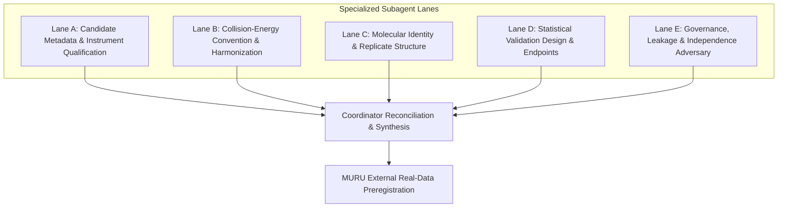
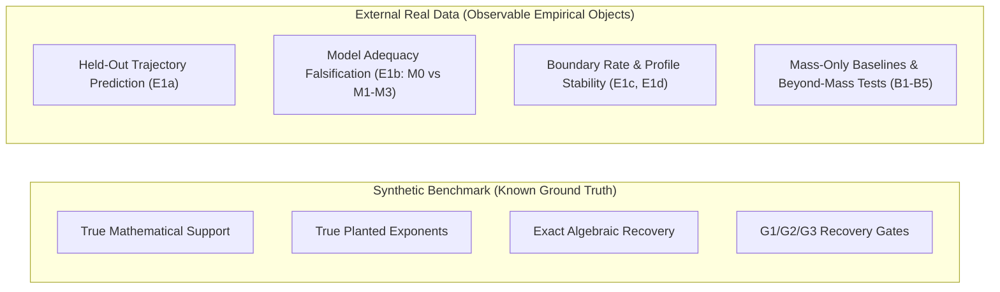

# MURU Prospective Real-Data External Validation Preregistration Protocol

**Status:** `DRAFT — FROZEN DESIGN ONLY — DO NOT EXECUTE`  
**Protocol Version:** `external-validation-draft-1.0`  
**Date:** 2026-08-14  
**Authoritative Protocol Basis:** [MURU_PUBLIC_DATA_FEASIBILITY_PROTOCOL.md](file:///Users/aryav/Documents/MURU-ConjectureLab-v1/.claude/worktrees/muru-lcmsms-feasibility-1ef59b/MURU_PUBLIC_DATA_FEASIBILITY_PROTOCOL.md) (commit `705adf8`)  
**Authoritative Feasibility Report:** [MURU_PUBLIC_DATA_FEASIBILITY_REPORT.md](file:///Users/aryav/Documents/MURU-ConjectureLab-v1/.claude/worktrees/muru-lcmsms-feasibility-1ef59b/MURU_PUBLIC_DATA_FEASIBILITY_REPORT.md)  
**Exposure Baseline:** [artifacts/public_data_exposure_set.json](file:///Users/aryav/Documents/MURU-ConjectureLab-v1/.claude/worktrees/muru-lcmsms-feasibility-1ef59b/artifacts/public_data_exposure_set.json) (781 InChIKey blocks)

---

## 1. Governance Boundary & Executive Mandate

This protocol establishes a prospective, outcome-blind design for future external validation of MURU using publicly accessible LC-MS/MS reference standard libraries identified in the frozen feasibility screen.

> [!CRITICAL]
> **STRICT GOVERNANCE PROHIBITIONS (DESIGN ONLY):**
> 1. **DO NOT RUN MURU ON ANY PUBLIC DATASET.**
> 2. **DO NOT PERFORM REAL-DATA SYMBOLIC DISCOVERY.**
> 3. **DO NOT FIT SCALAR FORMULAS OR ESTIMATE COMPOUND SCALES ($g$).**
> 4. **DO NOT CALCULATE EMPIRICAL PERFORMANCE ON REAL SPECTRA.**
> 5. **DO NOT INSPECT SYNTHETIC PROSPECTIVE HELD-OUT OR CONFIRMATION OUTCOMES.**
> 6. **HELD-OUT AND CONFIRMATION SETS REMAIN SEALED.**

### 1.1 Separation of Validation and Symbolic Discovery
Historical project governance (Phase 3 `STOP BEFORE PHASE 4`, commit `211b500`; Type 2 `DO NOT AUTHORIZE PHASE 4`, commit `adf7b3b`) authorizes neither Phase 4 nor real-data symbolic discovery.

This protocol distinguishes two separate activities:
- **Activity A (Locked External Validation):** Prospective evaluation of a locked, predefined mathematical representation and scalar collapse pipeline on independent real data.
- **Activity B (Real-Data Symbolic Discovery):** Symbolic search or equation learning on real experimental spectra.

Activity B is **NOT AUTHORIZED** under this protocol and is classified:
```
REQUIRES_NEW_SCIENTIFIC_AUTHORIZATION
```
No symbolic equation search on real data may be silently executed or scheduled without independent, formal scientific authorization.

---

## 2. Independent Subagent Analysis Lanes & Coordinator Synthesis

The design of this protocol was established via five independent subagent lanes and synthesized by the coordinator:



- **Lane A (Metadata & Instrument):** Evaluated physical instrument platforms, analyzer types (FTMS vs QTOF), ionization polarities, and spectrum accessibility across all 19 feasibility candidates.
- **Lane B (Collision Energy):** Harmonized CE representations across Class A (lab-frame eV/V), Class B (explicit NCE %), and Class C (labeled publication-derived NCE %). Established strict prohibition of cross-vendor pooling.
- **Lane C (Molecular Identity & Replicate Structure):** Established dual InChIKey 14-character connectivity vs 27-character stereoisomer partitioning, single adduct selection (`[M+H]+`), and separation of single-injection fast switching vs multi-injection independent acquisitions.
- **Lane D (Statistical Validation Design):** Formulated an observable-only endpoint hierarchy (held-out trajectory prediction, model adequacy M0 vs M1/M2/M3, boundary rates, profile stability, mass-only baselines, and mass-preserving nulls).
- **Lane E (Governance & Leakage):** Formulated leakage prevention controls, scaffold-disjoint splitting, and verified chemical and acquisition independence against the 781-block development exposure set.

---

## 3. Part 1 — Candidate Dataset Qualification

Four candidate datasets cleared all twelve eligibility criteria ($E_1$–$E_{12}$) in the authoritative feasibility screen:

1. **WFSR Food Safety Mass Spectral Library (Padilla-Gonzalez et al., *Anal. Chem.* 2025)**
   - *Platform:* Thermo Orbitrap IQ-X Tribrid (HCD, Positive ESI).
   - *CE Convention:* Class C, 6 discrete NCE % levels (`15, 30, 45, 60, 75, 90`).
   - *Scale:* 957 positive-mode qualifying groups (14-char block) / 998 groups (27-char full InChIKey).
   - *Chemical Independence:* 19.96% overlap with MURU development set (`CHEMICALLY_INDEPENDENT` $\le 20\%$). Non-overlapping subset: 766 compounds.
   - *Identity Quality:* Level 1 authentic commercial reference standards (1,001 compounds).
   - *Licensing:* CC0 on GNPS2; CC-BY 4.0 in primary article.

2. **MassBank Contributor BAFG (Collective Spectral Library, CSL)**
   - *Platform:* SCIEX TripleTOF 5600 / 6600 (Beam-type CID, Positive & Negative ESI).
   - *CE Convention:* Class A/C, 15 discrete collision cell voltages (`10 to 150 V` in 10 V steps).
   - *Scale:* 666 positive-mode groups on TripleTOF 5600 (Primary stratum); 331 on 6600 Pos; 247 on 5600 Neg.
   - *Chemical Independence:* 17.9% overlap with MURU development set (`CHEMICALLY_INDEPENDENT`).
   - *Identity Quality:* 100% Level 1 Reference Standards (20,658 / 20,658 records).
   - *Licensing:* `dl-de/by-2-0` (Data licence Germany attribution 2.0; fully open).

3. **MassBank Contributor Athens_Univ**
   - *Platform:* Bruker maXis Impact LC-ESI-QTOF (Beam-type CID, Positive ESI).
   - *CE Convention:* Class A, 5 discrete laboratory-frame levels (`10, 20, 30, 40, 50 eV`).
   - *Scale:* 544 positive-mode qualifying groups (maXis Positive stratum).
   - *Acquisition Structure:* Separate chromatographic injections per CE setting (retention times vary across energies in 504/567 groups).
   - *Chemical Independence:* 23.6% overlap (`PARTIAL_CHEMICAL_OVERLAP` $20\text{--}50\%$). Non-overlapping subset: 405 groups ($\ge 250$ floor).
   - *Licensing:* CC BY and CC BY-SA in qualifying stratum.

4. **MassBank Contributor Eawag (Level 1 Reference Standard Stratum)**
   - *Platform:* Thermo Exploris 240 Orbitrap (HCD, Positive ESI).
   - *CE Convention:* Class B, 6 discrete NCE % levels (`15, 30, 45, 60, 75, 90 % nominal`).
   - *Scale:* 326 positive-mode groups strictly restricted to Level 1 reference standards (1,966 annotation-level records excluded).
   - *Chemical Independence:* 18.3% overlap (`CHEMICALLY_INDEPENDENT`).
   - *Licensing:* CC BY-SA uniformly inside qualifying stratum.

---

## 4. Part 2 — Prospective Definition of Analysis Units

To eliminate post-hoc data filtering, all analysis units are prospectively bound:

### 4.1 Molecular Identity Unit & Connectivity Key
- **Primary Grouping Key:** 14-character first block of the InChIKey (`connectivity_key`), grouping stereoisomers into single molecular connectivity units.
- **Stereochemical Preservation:** Full 27-character InChIKey is recorded and tracked. Where stereoisomers exist, the representative structure is selected as the **lexicographically first deposited SMILES**.
- **Alternative Keying Audit:** The 27-character full InChIKey grouping is computed as a recorded sensitivity analysis; the primary 14-character keying is binding.

### 4.2 Adduct & Precursor Treatment
- **Stratification Rule:** Trajectories are strictly segregated by `(connectivity_key, adduct)`.
- **Primary Adduct Promotion:** For compounds with multiple qualifying adduct series, exactly one is promoted to the primary analysis population using the frozen priority:
  1. `[M+H]+` (if present and qualifying)
  2. Lexicographically first qualifying positive adduct string
- **Precursor Mass Consistency:** Across all energy records of a trajectory, declared precursor $m/z$ must match within **5 ppm** of the trajectory median.
- **No Adduct Pooling:** Spectra from different adducts (e.g., `[M+H]+`, `[M+Na]+`, `[M+NH4]+`) are **never pooled** into a single trajectory.

### 4.3 Replicate Structure & Aggregation
- **Within-Run Fast Switching (BAFG, WFSR, Eawag):** All energies acquired within a single chromatographic run. Replicate scans within a single compound-energy cell are collapsed: if byte-identical, collapsed to one; if differing, the lexicographically smallest accession is retained for primary analysis, and duplicates are routed to `EXTERNAL_REPEATABILITY_SET`.
- **Between-Run Multi-Injection (Athens_Univ):** Separate injections per collision energy provide genuine inter-injection variance.
- **No Inferred Replicates:** Unlabeled or unannotated spectra are not aggregated.

### 4.4 Instrument Stratum & Inclusion Boundaries
- **Instrument Stratum Definition:** A strict tuple: `(Instrument Model, Analyzer Type, Fragmentation Mode, Ionization Polarity, CE Representation Class)`.
- **Compound Inclusion:** Reference Standard Level 1 or verified standard compound only. MSI Level 2a/2b/3 putative annotations are strictly excluded.
- **Spectrum Inclusion:** MS2 spectra only; non-negative centroids; peak $m/z > 0$; peak $m/z \le \text{precursor\_mz} \times (1 + 10^{-5}) + 1.5\text{ Da}$; minimum 3 peaks per spectrum; total intensity $> 0$.

---

## 5. Part 3 — Collision-Energy Harmonization & Stratification

### 5.1 Collision Energy Representation Classes
Collision energy definitions are physically distinct and are never pooled without a frozen conversion:

| Class | Name | Physical Definition | Permitted Candidates |
|---|---|---|---|
| **Class A** | Lab-Frame Collision Energy | Potential difference in Volts ($V$) or lab-frame kinetic energy ($eV$) | MassBank BAFG ($V$), Athens_Univ ($eV$) |
| **Class B** | Normalized Collision Energy (NCE) | Mass-dependent scaled RF voltage (%) according to Thermo formula | MassBank Eawag (`% nominal`) |
| **Class C** | Labeled Assumed NCE | NCE (%) established via publication methods citations | WFSR Food Safety Library (`_CE15`..`_CE90`) |
| **Class D** | Ramped / Stepped Energy | Energy mixture over a range delivering a single merged spectrum | **EXCLUDED** from discrete CE series |

### 5.2 Prohibition of Post-Hoc Harmonization
- **No cross-vendor conversion may be invented after seeing evaluation outcomes.**
- QTOF collision cell potential (V) and Orbitrap HCD normalized collision energy (NCE %) represent different physical regimes. They are analyzed as **separate, independent instrument strata**.
- Trajectories are constructed strictly within a single CE representation class.

---

## 6. Part 4 — Chemical & Acquisition Independence

### 6.1 Baseline Exposure Set
MURU historical development was conducted exclusively on:
- MassBank contributor `LCSB` (release `2026.03`, commit `705afb7b`, 5,582 records, 781 unique InChIKey blocks).
- MassIVE `MSV000091754` (ENTACT campaigns `20190812_ENTACT_RP` and `20200303_ENTACT_RP`).

### 6.2 Candidate Overlap Classification
Under frozen criterion $E_9$:

| Candidate | Total Blocks | Overlap Blocks | Overlap % | Independence Classification | Clean Disjoint Subset |
|---|---|---|---|---|---|
| **WFSR Food Safety Library** | 957 | 191 | **19.96%** | `CHEMICALLY_INDEPENDENT` ($\le 20\%$) | **766 compounds** |
| **MassBank BAFG (5600 Pos)** | 1,119 | 200 | **17.9%** | `CHEMICALLY_INDEPENDENT` ($\le 20\%$) | **> 500 compounds** |
| **MassBank Athens_Univ (maXis Pos)**| 589 | 139 | **23.6%** | `PARTIAL_CHEMICAL_OVERLAP` ($20\text{--}50\%$) | **405 compounds** |
| **MassBank Eawag (Exploris 240)** | 1,383 | 253 | **18.3%** | `CHEMICALLY_INDEPENDENT` ($\le 20\%$) | **> 250 compounds** |

### 6.3 Prospective Non-Overlapping Protocol
For all candidates, the evaluation report must provide:
1. Primary evaluation on the complete qualifying candidate corpus.
2. Disjoint sensitivity evaluation strictly restricted to the non-overlapping subset ($\text{Candidate} \setminus \text{LCSB Exposure Set}$).
3. The non-overlapping subset is defined by deterministic InChIKey block matching before data opening, with zero outcome-based filtering.

---

## 7. Part 5 — The External Real-Data Scientific Question

### 7.1 What Real Data Can and Cannot Test



> [!WARNING]
> **NO GROUND-TRUTH STRUCTURAL RECOVERY CLAIMS ON REAL DATA:**
> Real experimental mass spectrometry data possesses **no known mathematical ground truth**. It cannot directly establish true algebraic support, true functional forms, or planted parameters. Therefore, all synthetic $G_1/G_2/G_3$ truth-recovery language is **strictly prohibited**.

### 7.2 Observable External Scientific Object
For compound $i$ and collision energy setting $E$:
$$\mu_i(E) \approx \Phi(E / g_i), \qquad g_i > 0$$
where $\mu$ is the intensity-weighted normalized first mass moment:
$$\mu = \frac{\sum_k I_k \cdot m_k}{\sum_k I_k \cdot m_{\text{precursor}}}$$
$\Phi$ is a shared monotone decreasing response curve learned strictly from training compounds, and $g_i$ is a molecule-specific horizontal scale estimated out-of-fold against the frozen training $\Phi$.

---

## 8. Part 6 — Deterministic Data Splitting Design

### 8.1 Scaffold-Disjoint Partitioning
- **Unit of Allocation:** Bemis–Murcko scaffold group (`scaffold_group`, RDKit path).
- **Proportions:** Train **60%** / Validation **20%** / Test **20%**, targeted on compound counts.
- **Algorithm:** Groups sorted by size (largest first, ties broken by seeded permutation); assigned greedily to whichever fold is furthest below its compound target (grouped fold balancing).
- **Frozen Seed:** `20260813`
- **Timing:** Splits assigned at Stage S2 from identity and scaffold metadata only, **before any $\mu$ is computed**.
- **No Outcome Balancing:** Folds are never balanced on precursor mass, spectral properties, or response outcomes.
- **Minimum Fold Size Floor:** $\ge 25$ scaffold groups and $\ge 100$ compounds in every fold.

### 8.2 Split Isolation & Leakage Canaries
- Test fold scored **exactly once**, at final evaluation stage S7.
- Mutation of any held-out compound must leave training $\Phi$, training $g$, training weights, and training variance bit-identical.

---

## 9. Part 7 — Primary & Secondary Real-Data Endpoints

### 9.1 Endpoint Hierarchy

| Endpoint | Scientific Question | Unit / Metric | Denominator | Failure Semantics | Uncertainty Estimation | Success Interpretation | Forbidden Interpretation |
|---|---|---|---|---|---|---|---|
| **E1a: Held-Out Trajectory Prediction** | Does the scalar model predict held-out trajectories on unseen scaffolds better than a baseline? | Mean Absolute Error (MAE) ratio $\le 0.80$ relative to training per-energy mean baseline | Held-out test compounds | $\text{Competence Rate} < 0.70$ on lower bound | Scaffold-clustered bootstrap (2,000 resamples) AND Wilson interval | The scalar representation generalizes out-of-sample on unseen scaffolds | Does NOT prove physical law or fragmentation mechanism |
| **E1b: Model Adequacy Ladder (M0)** | Is a single shared $\Phi$ and one scale $g$ adequate, or are shape/floor violations present? | Leave-one-energy-out error ratio vs $M_1, M_2, M_3$ alternatives | Held-out test trajectories | Lower bound of bootstrap error ratio $> 1.0$ (M0 rejected) | Compound-clustered bootstrap | The 1D scalar model is not contradicted by prespecified 2D alternatives | Does NOT prove $M_0$ is true in nature |
| **E1c: Boundary Hit Rate** | Does the profile optimizer land on artificial numerical boundaries? | Fraction of held-out compounds with $g$ at profile search bounds | Held-out test compounds | Upper 95% bound $> 0.20$ | Clustered bootstrap AND Wilson interval | Parameter identifiability is well-behaved across the population | Failure implies numerical unidentifiability, not model falsification |
| **E1d: Profile Stability** | Is the estimated scale $g$ stable across training subsamples? | Median pairwise Spearman correlation of $\log g$ across 5 scaffold-disjoint subsamples | Eligible paired compounds | Median pairwise Spearman $< 0.80$ | Empirical subsampling distribution | The horizontal scale is robustly identified from the training curve | Failure routes to INCONCLUSIVE |
| **E2: Structure Beyond Mass (Optional S5-S6)** | Does $g$ correlate with chemical structure beyond precursor mass? | Out-of-sample weighted $R^2$ improvement over strong mass baselines (`MASS_SIMPLE`, `MASS_FLEX`) | Held-out test compounds | Failure of any B1–B5 criteria or nulls N1–N4 | Paired scaffold-clustered bootstrap difference | Chemical descriptors beyond mass carry statistical association with $g$ | Association is NOT causation; does NOT establish physical mechanism |

### 9.2 Primary Scalar Composite Gate
$$\mathbf{E1} = \text{E1a} \land \text{E1b} \land \text{E1c} \land \text{E1d}$$
All four conditions must hold simultaneously for the primary scalar representation to be declared `SUPPORTED`.

---

## 10. Part 8 — Input Integrity & Early Stop Rules

### 10.1 Deterministic Input Integrity Gates (Stage S1)
- **I1–I14 Integrity Panel:** Hashing verification, census reproduction, spectrum availability, 6-energy completeness, identity consistency, precursor mass consistency ($\le 5\text{ ppm}$), non-negative finite peaks, minimum 3 peaks, duplicate resolution, scaffold grouping reproduction.
- **Integrity Attrition Floor:** Minimum 400 qualifying trajectories and 200 scaffold groups surviving integrity. Falling below this floor triggers `EXTERNAL INPUT INTEGRITY FAILED`.

### 10.2 Spectral Mass Support & Truncation Diagnostics (Stage S3)
- **U1 (Energy-Dependent Truncation):** Median within-compound range of observed minimum $m/z > 20\text{ Da}$ or $|\rho(\text{min\_mz}, \text{NCE})| \ge 0.30 \implies \text{STOP}$.
- **U2 (Mass-Proportional Truncation):** $\text{min\_mz} / \text{precursor\_mz} > 0.25$ in $> 20\%$ of spectra $\implies \text{STOP}$.
- **U3 (Truncation Non-Invariance):** Median $|\mu - \mu^{(c)}| > 0.02$ or within-energy Spearman $< 0.95 \implies \text{STOP}$.
- **U4 (Sparse Support):** $> 5\%$ spectra with $< 3$ peaks $\implies \text{STOP}$.
- Triggering U1–U4 yields `EXTERNAL ENDPOINT SUPPORT INCONCLUSIVE`.

### 10.3 Study Evaluability Classifications
- **`EVALUABLE`:** Dataset passes all integrity gates (I1–I14) and mass-support checks (U1–U4), clearing sample size floors ($\ge 400$ trajectories, $\ge 200$ scaffolds).
- **`PARTIALLY_EVALUABLE`:** Dataset passes integrity but requires restriction to a single instrument stratum or non-overlapping subset, or contains missing energy levels analyzed under secondary observed masks.
- **`NOT_EVALUABLE`:** Dataset fails integrity, exhibits unresolvable CE ambiguity, contains gross run-order aliasing, fails mass-support invariance, or drops below the 250-compound hard floor.

---

## 11. Part 9 — Dataset Execution Priority

Pre-outcome priority ranking:

1. **PRIMARY EXTERNAL VALIDATION DATASET:**
   - **WFSR Food Safety Mass Spectral Library**
   - *Role:* Primary prospective test of MURU scalar generalization on an independent Orbitrap HCD platform.
2. **BACKUP EXTERNAL DATASET 1:**
   - **MassBank Contributor BAFG (TripleTOF 5600 Positive Stratum)**
   - *Role:* Deep breakdown curve evaluation (15 voltages) and cross-platform QTOF beam-type CID transfer test.
3. **BACKUP EXTERNAL DATASET 2:**
   - **MassBank Contributor Athens_Univ (maXis Impact Positive Stratum)**
   - *Role:* Multi-injection acquisition evaluation testing inter-injection experimental repeatability.
4. **SUPPLEMENTARY EXTERNAL DATASET:**
   - **MassBank Contributor Eawag (Exploris 240 Level 1 Positive Stratum)**
   - *Role:* Supplementary modern Orbitrap cross-laboratory validation.

---

## 12. Hostile Adversarial Reviews & Defect Resolutions

### Reviewer 1: Data Independence & Leakage Adversary
- *Adversarial Challenge:* WFSR has 19.96% chemical overlap with MURU development compounds. Could this 0.04% margin below the 20% threshold permit subtle data leakage?
- *Design Resolution:* Overlap is strictly chemical (shared standard compound identities), not acquisition-derived (different instrument, lab, country, year). Furthermore, this protocol mandates a paired sensitivity evaluation on the completely disjoint 766-compound non-overlapping subset. Scaffold-disjoint splitting is asserted with automated leakage canaries.

### Reviewer 2: Collision-Energy Comparability Adversary
- *Adversarial Challenge:* BAFG uses collision cell Volts ($V$), Athens_Univ uses lab-frame $eV$, and WFSR/Eawag use NCE (%). Attempting to pool these would invalidate physical dimensions.
- *Design Resolution:* This protocol strictly forbids cross-vendor CE pooling. Each candidate represents a segregated, standalone instrument stratum evaluated on its own ratio-scale energy axis ($\max/\min \ge 2.0$).

### Reviewer 3: Statistical Endpoint Validity Adversary
- *Adversarial Challenge:* Standard binomial confidence intervals understate uncertainty when compounds cluster in scaffold families.
- *Design Resolution:* All primary rates must satisfy a strict **conjunction**: both a 2,000-resample scaffold-clustered bootstrap interval and a Wilson binomial interval must clear the frozen threshold.

### Reviewer 4: Overclaim & Synthetic-to-Real Inference Adversary
- *Adversarial Challenge:* Real data might tempt researchers to claim discovery of a "universal physical law of fragmentation" or "true mathematical family."
- *Design Resolution:* All synthetic $G_1/G_2/G_3$ ground-truth language is prohibited. Permitted claims are restricted strictly to empirical representation adequacy in deposited libraries. Mechanistic and causal claims are explicitly banned.

### Reviewer 5: Reproducibility & Licensing Adversary
- *Adversarial Challenge:* WFSR download terms from WUR specify research/educational use with publication permission required.
- *Design Resolution:* A hard governance gate (`G-PERM: PERMISSION_PENDING`) is established. No WFSR-derived MURU result may be externally disseminated without documented written consent from WFSR. BAFG (`dl-de/by-2-0`) and Athens_Univ (`CC BY`) provide unencumbered backup paths.

---

## 13. Terminal Protocol Outcome Tokens

The evaluation pipeline terminates in exactly one of the following immutable outcome tokens:

| Outcome Token | Meaning & Permitted Scope Sentence |
|---|---|
| `EXTERNAL INPUT INTEGRITY FAILED` | Retrieved dataset did not satisfy the frozen input contract. No MURU scientific endpoint was computed; nothing is implied about MURU. |
| `EXTERNAL ENDPOINT SUPPORT INCONCLUSIVE` | Deposited spectral mass support does not permit an interpretable fragment-mass endpoint. Property of deposited data, not MURU. |
| `EXTERNAL SCALAR REPRESENTATION NOT SUPPORTED` | On this independently acquired public library, the locked scalar representation did not meet preregistered held-out criteria. |
| `EXTERNAL SCALAR REPRESENTATION SUPPORTED` | On this independently acquired public library, the locked scalar representation met every preregistered held-out criterion. Representation adequacy in deposited library; not a physical law. |
| `EXTERNAL STRUCTURE BEYOND MASS NOT SUPPORTED` | No descriptor relation beyond frozen mass-only baselines met held-out and null criteria. |
| `EXTERNAL STRUCTURE BEYOND MASS SUPPORTED` | A $g$ relation with non-mass effective support beat mass baselines and survived nulls. Statistical association in deposited library; not a physical mechanism. |
| `EXTERNAL EVALUATION INCONCLUSIVE` | Evaluation could not be completed or scored as preregistered. No claim in either direction. |

---

## 14. Freeze Declaration

This protocol is a prospective **DRAFT DESIGN**. It does not execute science, does not calculate performance, and does not authorize Phase 4.
