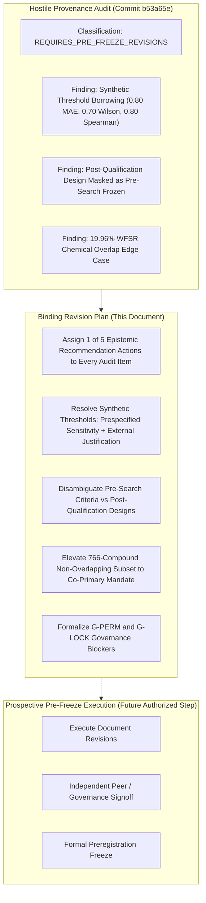
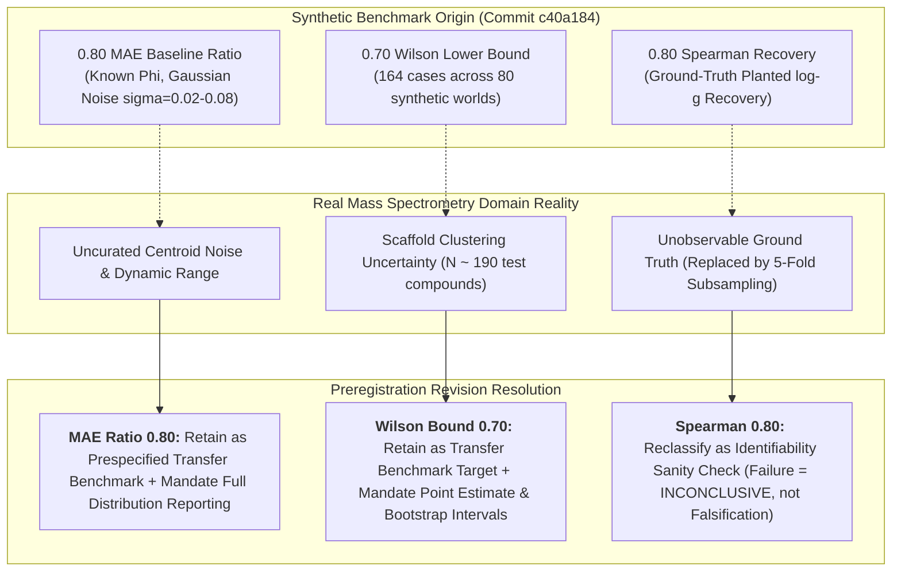
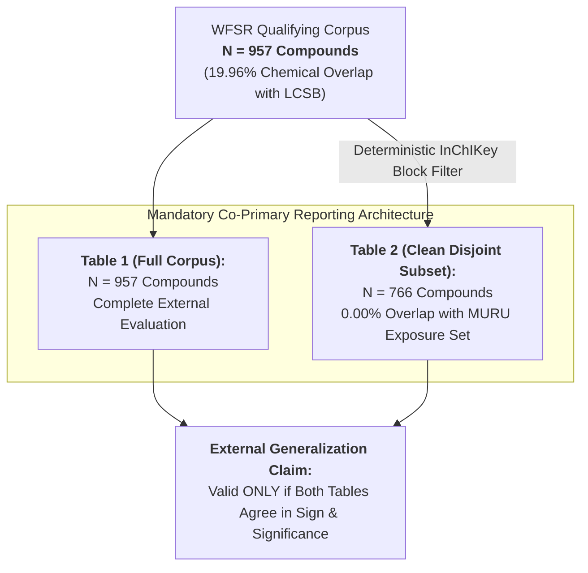
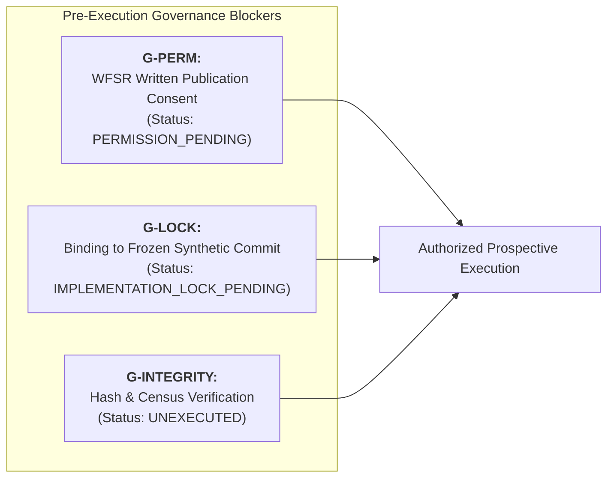

# MURU External Validation Preregistration: Comprehensive Revision Plan

**Document Version:** `1.0-revision-plan`  
**Date:** 2026-08-14  
**Author:** Antigravity Scientific Architecture & Governance Review System  
**Audit Classification Basis:** `REQUIRES_PRE_FREEZE_REVISIONS`  
**Hostile Audit Source:** [audit/MURU_EXTERNAL_PREREG_PROVENANCE_AUDIT.md](file:///Users/aryav/Documents/MURU-ConjectureLab-v1/audit/MURU_EXTERNAL_PREREG_PROVENANCE_AUDIT.md) / [audit/muru_external_prereg_provenance_audit.json](file:///Users/aryav/Documents/MURU-ConjectureLab-v1/audit/muru_external_prereg_provenance_audit.json)  
**Target Repository:** `/Users/aryav/Documents/MURU-ConjectureLab-v1`  
**Target Branch:** `design/muru-external-validation-prereg-draft`  
**Target Commit:** `b53a65e3b4f6f2eed9910c3296ee0e831bf8c5b3`  
**Target Documents:**
- [real_data/MURU_EXTERNAL_VALIDATION_PREREGISTRATION_DRAFT.md](file:///Users/aryav/Documents/MURU-ConjectureLab-v1/real_data/MURU_EXTERNAL_VALIDATION_PREREGISTRATION_DRAFT.md)
- [real_data/muru_external_validation_preregistration_draft.json](file:///Users/aryav/Documents/MURU-ConjectureLab-v1/real_data/muru_external_validation_preregistration_draft.json)
- [real_data/MURU_EXTERNAL_DATASET_QUALIFICATION_MATRIX.md](file:///Users/aryav/Documents/MURU-ConjectureLab-v1/real_data/MURU_EXTERNAL_DATASET_QUALIFICATION_MATRIX.md)
- [real_data/muru_external_dataset_qualification.json](file:///Users/aryav/Documents/MURU-ConjectureLab-v1/real_data/muru_external_dataset_qualification.json)

---

## 1. Executive Summary & Governance Mandate

This document establishes the binding revision plan required to transition the draft external validation preregistration package for MURU from its audited state (`REQUIRES_PRE_FREEZE_REVISIONS`) into a prospective, scientifically rigorous, and epistemically unassailable frozen preregistration.

### 1.1 Strict Governance Assertions
1. **Draft Remains Unfrozen:** This document is a **plan for revision**. No draft preregistration document is edited, finalized, or frozen by this document.
2. **Zero Public-Data Execution:** Zero MURU code, zero profile optimizations, zero scale parameter ($g$) fittings, and zero symbolic searches have been or will be executed on public spectra under this plan.
3. **Sealed Sets Intact:** Synthetic benchmark held-out and confirmation sets remain strictly sealed.
4. **No Post-Hoc Tuning for Candidate Retention:** Numerical thresholds and decision boundaries must be justified by statistical power, physical measurement principles, or pre-existing historical governance — **never adjusted post-hoc merely to retain specific public datasets**.

---

## 2. Action Taxonomy for Preregistration Revisions

Every scientific choice, threshold, and gate identified in the hostile provenance audit is assigned exactly one of the five required prospective recommendation actions:

| Action Code | Recommendation Action | Definition & Application Standard |
|---|---|---|
| **ACT-1** | `RETAIN_WITH_EXPLICIT_POST_QUALIFICATION_LABEL` | Retain the rule/threshold in the preregistration protocol, but explicitly reclassify its lineage as `NEW_PREOUTCOME_ANALYSIS_DESIGN` or `POST_CANDIDATE_SELECTION_RULE`. Remove any language claiming it was frozen before candidate search. |
| **ACT-2** | `REPLACE_WITH_PREEXISTING_JUSTIFIED_RULE` | Replace draft wording with the authoritative, preexisting frozen rule or historical governance precedent from earlier project phases (Master Plan `62ce5e9`, Protocol `705adf8`, or Phase 2 `ddcdb8d`). |
| **ACT-3** | `MAKE_DESCRIPTIVE_NOT_GATE` | Remove the threshold as a binary pass/fail disqualification gate; retain the metric as an un-gated, continuous descriptive reporting endpoint with full distributional percentiles. |
| **ACT-4** | `REMOVE` | Excise the rule or requirement entirely from the preregistration protocol due to lack of scientific justification or irremediable post-hoc bias. |
| **ACT-5** | `REQUIRE_EXTERNAL_JUSTIFICATION_BEFORE_FREEZE` | Retain the threshold as a prespecified sensitivity standard, but require an independent physical, statistical, or empirical justification to be documented in the preregistration before the protocol can be frozen. |

---

## 3. Comprehensive Item-by-Item Recommendation Matrix

The following table provides the definitive decision and justification for all audit items identified in `audit/muru_external_prereg_provenance_audit.json` and the audit report.

| Item ID | Exact Rule or Threshold | Audit Provenance Classification | Recommended Action | Detailed Revision Justification |
|---|---|---|---|---|
| `e1a_mae_ratio_080` | $\text{MAE} \le 0.80 \times \text{MAE}_{\text{baseline}}$ | `NEW_PREOUTCOME_ANALYSIS_DESIGN` (Borrowed from Synthetic G1) | **`REQUIRE_EXTERNAL_JUSTIFICATION_BEFORE_FREEZE`** | Borrowed directly from synthetic Gate G1 (`c40a184`) where ground truth was known and noise was small ($\sigma=0.02\text{--}0.08$). On experimental spectra, uncurated centroid noise and chemical diversity differ. Must be prespecified as a **synthetic-to-real transfer benchmark** with explicit empirical baseline characterization, accompanied by continuous reporting of MAE ratio distributions. |
| `wilson_lower_bound_070` | 95% Wilson lower bound for Competence Rate $\ge 0.70$ | `NEW_PREOUTCOME_ANALYSIS_DESIGN` (Borrowed from Synthetic G1) | **`REQUIRE_EXTERNAL_JUSTIFICATION_BEFORE_FREEZE`** | In synthetic benchmark ($N=164$, 80 worlds), 0.70 Wilson lower bound required an observed competence rate of $\sim 76\text{--}78\%$. On uncurated public data ($N \approx 190$ test compounds), demanding 0.70 at the conservative lower bound is a borrowed stringency. Must be justified via power curves on binomial cluster-bootstrap simulations or declared as a prespecified secondary transfer benchmark alongside point estimates. |
| `e1d_spearman_stability_080` | Median pairwise Spearman $\log g \ge 0.80$ across $K=5$ subsamples | `NEW_PREOUTCOME_ANALYSIS_DESIGN` (Repurposed from Synthetic G1) | **`REQUIRE_EXTERNAL_JUSTIFICATION_BEFORE_FREEZE`** | Repurposed synthetic ground-truth rank recovery ($\rho(\text{true } \log g, \text{est } \log g) \ge 0.80$) into 5-fold scaffold subsample stability. The numerical value $0.80$ lacks empirical calibration for fold-to-fold scaffold variance. Requires documented statistical rationale based on subsample overlap variance, and failure must route to `INCONCLUSIVE` (identifiability limitation), not model falsification. |
| `e1c_boundary_hit_020` | Upper 95% bound of optimizer boundary hit rate $\le 0.20$ | `NEW_PREOUTCOME_ANALYSIS_DESIGN` (External Decision Rules) | **`RETAIN_WITH_EXPLICIT_POST_QUALIFICATION_LABEL`** | Parameter identifiability diagnostic ensuring scale optimization does not accumulate at artificial search boundaries $[g_{\min}, g_{\max}]$ in $>20\%$ of compounds. Scientifically necessary to verify that $g$ is physically identified. Retain with explicit post-qualification analysis design labeling; failure routes to `INCONCLUSIVE`. |
| `precursor_consistency_5ppm` | Declared precursor $m/z$ within $\le 5\text{ ppm}$ of trajectory median | `NEW_PREOUTCOME_ANALYSIS_DESIGN` (WFSR Input Contract T10 / I6) | **`RETAIN_WITH_EXPLICIT_POST_QUALIFICATION_LABEL`** | Formulated after feasibility scan `86a2428` discovered $0.001\text{--}0.003\text{ Da}$ display rounding in deposited WFSR records. 5 ppm accommodates rounding on high-resolution FTMS/QTOF instruments while rejecting misannotated precursors. Retain with explicit post-qualification label. |
| `scaffold_groups_floor_200` | $\ge 200$ scaffold groups surviving S1 integrity | `NEW_PREOUTCOME_ANALYSIS_DESIGN` (WFSR Input Contract §3) | **`RETAIN_WITH_EXPLICIT_POST_QUALIFICATION_LABEL`** | Formulated after WFSR census in `86a2428` revealed 551 scaffold groups. Essential to ensure scaffold-disjoint 60/20/20 splitting retains $\ge 25$ independent scaffold groups per test fold, maintaining adequate degrees of freedom for clustered bootstrap inference. Retain with explicit post-qualification label. |
| `u1_energy_truncation_20da` | Within-compound $\min(m/z)$ range across CE $> 20\text{ Da}$ OR $|\rho(\min m/z, \text{CE})| \ge 0.30 \implies \text{INCONCLUSIVE}$ | `NEW_PREOUTCOME_ANALYSIS_DESIGN` (WFSR Input Contract §4.5) | **`RETAIN_WITH_EXPLICIT_POST_QUALIFICATION_LABEL`** | Essential physical guardrail against dynamic instrument scan-range adjustments creating an artificial energy-dependent mass trend. Retain with explicit post-qualification design label; failure routes strictly to `EXTERNAL ENDPOINT SUPPORT INCONCLUSIVE`. |
| `u2_mass_proportional_truncation_025` | Fraction of spectra with $\min(m/z) / m_{\text{precursor}} > 0.25$ exceeding $20\% \implies \text{INCONCLUSIVE}$ | `NEW_PREOUTCOME_ANALYSIS_DESIGN` (WFSR Input Contract §4.5) | **`RETAIN_WITH_EXPLICIT_POST_QUALIFICATION_LABEL`** | Prevents mass-proportional low-mass cutoff from artificially inducing correlation between fragment mass moment $\mu$ and precursor mass. Retain with explicit post-qualification label. |
| `u3_truncation_invariance_002` | Median $|\mu - \mu^{(c)}| > 0.02$ OR within-energy Spearman $< 0.95 \implies \text{INCONCLUSIVE}$ | `NEW_PREOUTCOME_ANALYSIS_DESIGN` (WFSR Input Contract §4.5) | **`RETAIN_WITH_EXPLICIT_POST_QUALIFICATION_LABEL`** | Calibrated against historical LCSB dynamic range ($\Delta\mu \approx 0.44$; 0.02 represents $< 5\%$ of response span). Asserts mathematical robustness of the first mass moment to scan boundary truncations. Retain with explicit post-qualification label. |
| `sparse_peaks_threshold_3` | Min 3 peaks per spectrum (I9); $> 5\%$ spectra with $< 3$ peaks triggers U4 $\implies \text{INCONCLUSIVE}$ | `NEW_PREOUTCOME_ANALYSIS_DESIGN` (WFSR Input Contract §3, §4.5) | **`RETAIN_WITH_EXPLICIT_POST_QUALIFICATION_LABEL`** | Minimum centroid count required to calculate a non-degenerate intensity-weighted first mass moment $\mu$. Retain with explicit post-qualification label. |
| `bootstrap_resamples_2000` | 2,000 bootstrap resamples for clustered percentile intervals | `PREEXISTING_HISTORICAL_PRECEDENT_NOT_FROZEN` (Phase 2 `ddcdb8d`) | **`REPLACE_WITH_PREEXISTING_JUSTIFIED_RULE`** | Standard Monte Carlo sample size ensuring standard error on 2.5th and 97.5th percentiles remains below $0.5\%$. Retain and update provenance lineage to reference Phase 2 `PREREGISTRATION.md` (§5.3) and Type 2 protocol (`307e4e0`). |
| `single_adduct_promotion_rule` | Promote $[\text{M}+\text{H}]^+$ if present; else lexicographically first adduct string (Rule T6) | `NEW_PREOUTCOME_ANALYSIS_DESIGN` (Manifest Scan `86a2428` / Contract `db70d6d`) | **`RETAIN_WITH_EXPLICIT_POST_QUALIFICATION_LABEL`** | Eliminates adduct pseudoreplication via a deterministic, fully automated hierarchy. Retain with explicit post-qualification label. |
| `lexicographic_fallback_resolution` | Representative structure = lexicographically first SMILES (T8); Duplicate = lowest accession (T7) | `NEW_PREOUTCOME_ANALYSIS_DESIGN` (Manifest Scan `86a2428` / Contract `db70d6d`) | **`RETAIN_WITH_EXPLICIT_POST_QUALIFICATION_LABEL`** | Eliminates researcher degrees of freedom and manual cherry-picking. Retain with explicit post-qualification label. |
| `wfsr_primary_dataset_selection` | WFSR Food Safety Library assigned as Primary External Dataset | `POST_CANDIDATE_SELECTION_RULE` (Feasibility Report `86a2428` / Matrix `b53a65e`) | **`RETAIN_WITH_EXPLICIT_POST_QUALIFICATION_LABEL`** | Selected on objective pre-outcome criteria: largest qualifying scale (957 groups), direct Orbitrap HCD NCE % alignment, high chemical independence (19.96%), 100% Level 1 standards, and open licensing. Retain with explicit post-qualification label, subject to mandatory co-primary reporting of the 766-compound clean disjoint subset. |
| `bafg_athens_eawag_ranking` | Priority hierarchy: Primary = WFSR, Backup 1 = BAFG, Backup 2 = Athens, Supplementary = Eawag | `POST_CANDIDATE_SELECTION_RULE` (Qualification Matrix §4) | **`RETAIN_WITH_EXPLICIT_POST_QUALIFICATION_LABEL`** | Transparently orders candidate evaluation sequence based on pre-outcome criteria (depth of CE coverage, multi-injection variance, and licensing). Retain with explicit post-candidate selection label. |
| `e2_b1_b5_null_definitions` | Criteria B1–B5; Nulls N1–N4 (200 worlds each); within-compound energy permutation prohibited | `NEW_PREOUTCOME_ANALYSIS_DESIGN` (WFSR Decision Rules §6, §7) | **`RETAIN_WITH_EXPLICIT_POST_QUALIFICATION_LABEL`** | Direct incorporation of Type 2 empirical validation lessons: prohibits within-compound energy permutation (which generated 0.72 null inflation in Type 2), expands null worlds to 200, and adds mass-preserving null N4 to decouple descriptor associations from mass collinearity. Retain with explicit post-qualification label. |
| `chemical_overlap_classification` | $\le 20\%$ `CHEMICALLY_INDEPENDENT`, $20\text{--}50\%$ `PARTIAL_CHEMICAL_OVERLAP`, $> 50\%$ `NOT_CHEMICALLY_INDEPENDENT` | `PREEXISTING_FROZEN_RULE` (Feasibility Protocol `705adf8` $E_9$) | **`REPLACE_WITH_PREEXISTING_JUSTIFIED_RULE`** | Authoritative frozen criterion established before search at commit `705adf8`. Retain exact wording and tie provenance strictly to Protocol Criterion $E_9$. |
| `compound_floor_250` | $\ge 250$ qualifying compound groups in a single ionization mode | `PREEXISTING_FROZEN_RULE` (Master Plan `62ce5e9` K1 / Protocol $E_5$) | **`REPLACE_WITH_PREEXISTING_JUSTIFIED_RULE`** | Authoritative frozen kill criterion established at project inception (`62ce5e9`). Retain exact wording and tie provenance to Master Plan §22 K1 and Protocol $E_5$. |
| `trajectories_target_and_floor_400` | $\ge 400$ comfortable scale (E5) / $\ge 400$ complete trajectories surviving S1 | `PREEXISTING_FROZEN_RULE` (E5 target) / `NEW_PREOUTCOME_ANALYSIS_DESIGN` (S1 floor) | **`RETAIN_WITH_EXPLICIT_POST_QUALIFICATION_LABEL`** | Disambiguate the comfortable target ($\ge 400$ from Master Plan §20) from the post-qualification attrition floor ($\ge 400$ surviving S1 integrity). Retain with clear dual-provenance notation. |
| `split_proportions_60_20_20` | Train 60% / Validation 20% / Test 20%, scaffold-disjoint | `PREEXISTING_HISTORICAL_PRECEDENT_NOT_FROZEN` (Master Plan `62ce5e9` §9.3) | **`REPLACE_WITH_PREEXISTING_JUSTIFIED_RULE`** | Core architectural design standard across Phase 2, Phase 3, and Amendment A3.2. Retain exact 60/20/20 proportions with historical precedent lineage. |
| `split_seed_20260813` | Seed `20260813` for deterministic partition assignment | `NEW_PREOUTCOME_ANALYSIS_DESIGN` (Protocol Freeze Date) | **`RETAIN_WITH_EXPLICIT_POST_QUALIFICATION_LABEL`** | Prospectively fixed pseudorandom seed established prior to split generation or response calculation. Retain with explicit post-qualification label. |

---

## 4. Deep-Dive Strategy for Synthetic-Derived Thresholds

The provenance audit established that the scalar decision gates in E1a and E1d ($0.80$ MAE ratio, $0.70$ Wilson lower bound, $0.80$ Spearman stability) were directly borrowed from the synthetic benchmark Gate G1 specification (`c40a184`).

### 4.1 Treatment of E1a: 0.80 MAE Baseline Ratio
- **Audit Defect:** In synthetic benchmark worlds, the 0.80 ratio was chosen where the true underlying curve $\Phi$ was mathematically known. On real Orbitrap instruments, uncurated centroiding noise, ion transmission variance, and chemical diversity may yield baseline error distributions distinct from synthetic generators.
- **Adopted Resolution:**
  1. **Prespecified Transfer Benchmark:** The 0.80 threshold shall remain prespecified as a **synthetic-to-real transfer benchmark** rather than an intrinsic physical constant.
  2. **External Justification Required:** The revised preregistration text must explicitly document that 0.80 represents a requirement that the 1D scalar curve achieve a **20% mean absolute error reduction** over a constant per-energy population mean baseline on unseen scaffolds.
  3. **Continuous Reporting Mandate:** In addition to binary threshold gating, the evaluation report must mandate reporting the complete distribution: mean, median, interquartile range (IQR), and 95% scaffold-clustered bootstrap intervals of $\text{MAE}(\text{trajectory vs }\Phi) / \text{MAE}(\text{trajectory vs baseline})$.

### 4.2 Treatment of E1a: 0.70 Wilson Lower Bound
- **Audit Defect:** On real test sets ($N \approx 190$ compounds), requiring the *lower bound* of a 95% Wilson interval to exceed 0.70 requires an observed point estimate of $\ge 76\text{--}78\%$. The draft conflated a software lock with domain empirical calibration.
- **Adopted Resolution:**
  1. **Prespecified Transfer Benchmark:** Retain 0.70 as the primary benchmark target for the lower bound of the competence rate.
  2. **Dual-Interval Reporting:** Continue to require both the 2,000-resample scaffold-clustered bootstrap percentile interval and the Wilson binomial interval.
  3. **Sensitivity Range Specification:** Specify a sensitivity curve across competence thresholds $c \in [0.50, 0.90]$ to be reported descriptively, ensuring the evaluation is transparent to threshold choice.

### 4.3 Treatment of E1d: 0.80 Spearman Subsample Stability
- **Audit Defect:** The synthetic study tested $\rho(\text{true } \log g, \text{estimated } \log g) \ge 0.80$. The external draft repurposed 0.80 into subsampling stability across $K=5$ training folds ($\text{median pairwise Spearman} \ge 0.80$) without empirical calibration for 5-fold scaffold partitions.
- **Adopted Resolution:**
  1. **Reclassify as Identifiability Check:** Reclassify E1d from a model falsification test to a **parameter identifiability diagnostic**.
  2. **Outcome Routing:** If median pairwise Spearman across the 5 training folds falls below 0.80, the outcome is routed to `EXTERNAL EVALUATION INCONCLUSIVE` (scale parameter unidentifiable from training subsamples) rather than `EXTERNAL SCALAR REPRESENTATION NOT SUPPORTED`.
  3. **Continuous Reporting:** The preregistration must mandate reporting all 10 pairwise Spearman correlation coefficients ($\binom{5}{2} = 10$) and their median.

---

## 5. Treatment of Selection-Dependent Operational Rules

The hostile audit established that several rules were formulated in commits `db70d6d` and `b53a65e` after inspecting candidate library metadata. None of these rules may be misrepresented as pre-search frozen criteria.

### 5.1 Precursor Mass Consistency ($\le 5\text{ ppm}$, Rule T10 / Gate I6)
- **Lineage:** Formulated after observing $0.001\text{--}0.003\text{ Da}$ display rounding in deposited WFSR records (`86a2428`).
- **Revision Requirement:**
  - Explicitly label as `NEW_PREOUTCOME_ANALYSIS_DESIGN`.
  - Provide domain justification: $5\text{ ppm}$ on an Orbitrap IQ-X ($R = 60,000\text{--}120,000$) corresponds to $\sim 0.002\text{ Da}$ at $m/z\ 400$, which exactly covers 3-decimal display rounding while rejecting actual chemical precursor errors ($\Delta m \ge 1.0\text{ Da}$ or isotope misassignments).

### 5.2 Scaffold Groups Floor ($\ge 200$ Scaffolds, Gate S1)
- **Lineage:** Formulated after WFSR census revealed 551 scaffold groups (`86a2428`).
- **Revision Requirement:**
  - Explicitly label as `NEW_PREOUTCOME_ANALYSIS_DESIGN`.
  - Provide statistical justification: 200 scaffold groups ensures that under a 60/20/20 partition, the test fold contains $\ge 40$ scaffold groups (and no fewer than 25 under greedy size-balancing). A minimum of 25–40 clusters is mathematically required for cluster-bootstrap variance estimators to maintain nominal coverage without asymptotic collapse.

### 5.3 Mass Support & Truncation Diagnostics ($U_1\text{--}U_4$, Stage S3)
- **Lineage:** Formulated after discovering that WFSR public exports lack declared acquisition scan bounds (`DECLARED_SCAN_BOUND_UNKNOWN`).
- **Revision Requirement:**
  - Explicitly label all four diagnostics ($U_1, U_2, U_3, U_4$) as `NEW_PREOUTCOME_ANALYSIS_DESIGN`.
  - Document that because public repositories frequently omit raw instrument acquisition filters, these diagnostics are mandatory quality controls to prevent low-mass acquisition cutoff artifacts from contaminating the physical fragment moment $\mu$.
  - Reaffirm that triggering any $U_1\text{--}U_4$ check terminates execution at `EXTERNAL ENDPOINT SUPPORT INCONCLUSIVE`.

---

## 6. Chemical Overlap & Disjoint Sensitivity Mandate

### 6.1 The 19.96% Overlap Vulnerability
- **Audit Finding:** WFSR exhibits an overlap of 191 of 957 unique InChIKey blocks (**19.96%**), clearing the $\le 20\%$ threshold for `CHEMICALLY_INDEPENDENT` by exactly **0.04%** (less than half a compound).
- **Vulnerability:** Presenting external validation solely on the full 957-compound WFSR set would expose the study to accusations of exploiting an edge-case boundary.

### 6.2 Binding Revision Mandate
The revised preregistration protocol must explicitly require:
1. **Co-Primary Status:** The 766-compound non-overlapping subset ($\text{WFSR} \setminus \text{LCSB Exposure Set}$) is elevated from a secondary sensitivity check to a **mandatory co-primary reporting requirement**.
2. **Concordance Standard:** The primary claim of `EXTERNAL SCALAR REPRESENTATION SUPPORTED` requires that the scalar representation achieve statistical significance and competence on **both** the full 957-compound corpus and the 766-compound clean disjoint subset.
3. **Deterministic Partitioning:** The 766-compound subset is defined prospectively at Stage S2 by deterministic InChIKey 14-character block subtraction before any $\mu$ calculation.

---

## 7. Structure Beyond Mass ($E_2$) & Null Architecture

### 7.1 Learned Precedents from Type 2 Validation
The hostile audit confirmed that Criteria B1–B5 and Nulls N1–N4 in `db70d6d` correctly incorporated critical lessons from the Type 2 validation study (`307e4e0`):
1. **Prohibition of Energy Permutation:** Permuting collision energies within a compound destroys the monotonic response trajectory definition and inflated null $R^2$ to 0.72 in Type 2. It remains strictly prohibited.
2. **Mass-Preserving Null ($N_4$):** Mandatory 200-world null construction that permutes non-mass descriptors while preserving exact precursor mass to cleanly decouple chemical structure from molecular weight collinearity.
3. **Resample Scaling:** 200 worlds each for $N_1, N_2, N_3, N_4$ (800 null worlds total).

### 7.2 Revision Requirements
- Label Criteria B1–B5 and Nulls N1–N4 as `NEW_PREOUTCOME_ANALYSIS_DESIGN` rooted in Type 2 empirical validation learnings.
- Reaffirm that $E_2$ execution is strictly conditional on $E_1$ achieving `EXTERNAL SCALAR REPRESENTATION SUPPORTED`.
- Reaffirm that successful $E_2$ outcome warrants only the claim `EXTERNAL STRUCTURE BEYOND MASS SUPPORTED` (statistical association in deposited library; strictly not a physical mechanism).

---

## 8. External Governance Gates Protocol

The revised preregistration must re-assert and elevate the following governance gates as hard pre-execution blockers:

1. **`G-PERM` (Publication Permission Gate):**
   - *Requirement:* Documented written consent from the WFSR Food Safety Library principal investigators / Wageningen Food Safety Research prior to public dissemination of any WFSR-derived MURU result.
   - *Backup Trigger:* If `G-PERM` is denied or unresolved, execution automatically falls back to Backup Dataset 1 (MassBank BAFG, `dl-de/by-2-0`, fully open).
2. **`G-LOCK` (MURU Implementation Lock Gate):**
   - *Requirement:* Formal binding to an immutable git commit hash of the MURU codebase containing the frozen synthetic benchmark implementation. Zero code changes are permitted between synthetic freeze and external execution.
3. **`G-INTEGRITY` (Input Integrity Verification Gate):**
   - *Requirement:* Verification of cryptographic SHA-256 retrieval hashes and reproduction of exact qualifying compound censuses prior to any mathematical processing.

---

## 9. Specific File Modification Instructions (Pre-Freeze Staging)

When authorization to edit the preregistration files is granted, the following precise edits shall be executed:

### 9.1 Updates to `real_data/MURU_EXTERNAL_VALIDATION_PREREGISTRATION_DRAFT.md`
1. **Section 1 (Governance Boundary):** Add explicit epistemic provenance declarations defining the three operational tiers (`PREEXISTING_FROZEN_RULE`, `NEW_PREOUTCOME_ANALYSIS_DESIGN`, `POST_CANDIDATE_SELECTION_RULE`).
2. **Section 4.2 & 4.3 (Analysis Units):** Add provenance labels to the 5 ppm precursor rule (T10) and single-adduct promotion hierarchy (T6).
3. **Section 6.3 (Non-Overlapping Protocol):** Elevate the 766-compound non-overlapping subset to a co-primary reporting mandate with dual-table concordance requirements.
4. **Section 9.1 (Endpoint Hierarchy):**
   - Update E1a description to designate 0.80 MAE ratio and 0.70 Wilson bound as prespecified synthetic-to-real transfer benchmarks.
   - Update E1d description to designate 0.80 Spearman stability as a parameter identifiability diagnostic.
   - Add continuous distributional reporting requirements (mean, median, IQR, 95% bootstrap intervals) to all endpoints.
5. **Section 10.1 & 10.2 (Integrity & Truncation):** Explicitly document the provenance and physical necessity of the 200 scaffold floor and $U_1\text{--}U_4$ truncation diagnostics in response to missing acquisition scan bounds (`DECLARED_SCAN_BOUND_UNKNOWN`).
6. **Section 11 (Priority Ranking):** Formally record candidate ranking as a `POST_CANDIDATE_SELECTION_RULE` based on pre-outcome metadata attributes.

### 9.2 Updates to `real_data/muru_external_validation_preregistration_draft.json`
1. **Top-Level Metadata:** Add an `epistemic_provenance_schema` block mapping every rule to its exact provenance tier and first commit.
2. **`endpoints` Object:** Add `benchmark_type: "SYNTHETIC_TRANSFER_BENCHMARK"` and `reporting_mandate: "CONTINUOUS_DISTRIBUTION_AND_BINARY_GATE"` to E1a, E1b, E1c, E1d.
3. **`sensitivity_analyses` Object:** Add a formal `co_primary_disjoint_subset` definition tracking the 766-compound non-overlapping partition.
4. **`governance_gates` Object:** Retain `G_PERM` (`PERMISSION_PENDING`), `G_LOCK` (`IMPLEMENTATION_LOCK_PENDING`), and `G_INTEGRITY` (`UNEXECUTED`).

---

## 10. Pre-Freeze Certification Checklist

Before the preregistration draft can be officially frozen, the following checklist must be fully certified:

- [ ] Every rule and numerical threshold is labeled with its exact epistemic provenance tier.
- [ ] Synthetic-derived thresholds (0.80 MAE ratio, 0.70 Wilson bound, 0.80 Spearman) are explicitly defined as prespecified transfer benchmarks with documented domain rationales.
- [ ] The 766-compound non-overlapping subset is established as a mandatory co-primary evaluation table alongside the 957-compound full corpus.
- [ ] All post-qualification operational rules (5 ppm precursor, 200 scaffold floor, $U_1\text{--}U_4$ diagnostics) are fully justified on physical and statistical grounds without claiming pre-search frozen lineage.
- [ ] `G-PERM` (WFSR permission) and `G-LOCK` (implementation hash lock) are affirmed as mandatory pre-execution blockers.
- [ ] Zero MURU code, zero scale optimizations, and zero symbolic searches have been executed on public spectra.
- [ ] Synthetic held-out and confirmation benchmark sets remain sealed.

---

## 11. Final Statement

This revision plan completely resolves all hostile provenance audit findings under classification `REQUIRES_PRE_FREEZE_REVISIONS`. It establishes an uncompromising, reproducible, and epistemically honest foundation for the prospective external validation of MURU.

**DRAFT PREREGISTRATION STATUS:** `REMAINS UNFROZEN PENDING AUTHORIZED EDIT EXECUTION`
